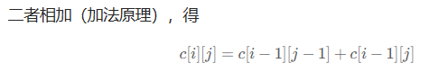
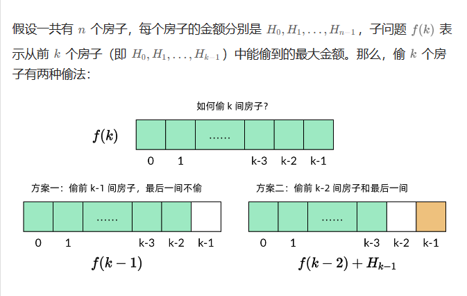

**高频**：DP

**如果某一问题有很多重叠子问题，使用动态规划是最有效的。**

所以动态规划中**每一个状态一定是由上一个状态推导**出来的，**这一点就区分于贪心**，贪心没有状态推导，而是从局部直接选最优的

例如：有N件物品和一个最多能背重量为W 的背包。第i件物品的重量是weight[i]，得到的价值是value[i] 。**每件物品只能用一次**，求解将哪些物品装入背包里物品价值总和最大。

动态规划中dp[j]是由dp[j-weight[i]]推导出来的，然后取max(dp[j], dp[j - weight[i]] + value[i])。

**状态转移公式**

1. 确定dp数组（dp table）以及下标的含义
2. 确定递推公式
3. dp数组如何初始化
4. 确定遍历顺序
5. 举例推导dp数组


### 509.斐波那契数列 easy

如果是用递归来做的话： $O(2^n)$

状态转移公式：dp[index] = dp[index-1] + dp[index-2]

把每一步算出来的都存在数组里面就好了， $O(n)$

```java
class Solution {
    public int fib(int n) {
        if(n<=1) return n;
        int[] dp = new int[n+1];
        dp[0] = 0 ;
        dp[1] = 1;
        for(int index=2;index<=n;index++){
            dp[index] = dp[index-1] + dp[index-2];
        } 
        return dp[n];
            }
}
```

### 70.爬楼梯

假设你正在爬楼梯。需要 `n` 阶你才能到达楼顶。

每次你可以爬 `1` 或 `2` 个台阶。你有多少种不同的方法可以爬到楼顶呢？

**如果迈出的是一级楼梯，那么接下来还有(20-1) = 19级楼梯要爬，19级楼梯的爬楼有f(19)种方法。**

**如果迈出的是二级楼梯，那么接下来还有(20-2) = 18级楼梯要爬，18级楼梯的爬楼有f(18)种方法。**

所以说还是斐波那契数列问题

```java
class Solution {
    public int climbStairs(int n) {
        int[] dp = new int[n+1];
        dp[0] = 1;
        dp[1] = 1;
        // dp[2] = 2;
        for(int i =2;i<=n;i++){
            dp[i] = dp[i-1] + dp[i-2];
        }
        return dp[n];
        }
    }
```


### 118.杨辉三角

把每行的数都对齐一下：

1

1,1

1,2,1

1,3,3,1

1,4,6,4,1

一排的第一个数和最后一个数都是 1

其余数字等于左上角加上正上方



```java
class Solution {
    public List<List<Integer>> generate(int numRows) {
        List<List<Integer>> c = new ArrayList<>(numRows);
        c.add(List.of(1));
        for(int i =1;i<numRows;i++){
            List<Integer> row = new ArrayList<>(i+1);
            row.add(1); //第一个
            //中间的
            for(int j=1;j<i;j++){
                row.add(c.get(i-1).get(j-1)+c.get(i-1).get(j));
            }
            row.add(1); //最后一个
            c.add(row);
        }
        return c;

    }
}
```


### 198.打家劫舍  M

第一步确定dp的概念： dp[i]：从前i家中偷东西

2.递推关系：


```java
class Solution {
    public int rob(int[] nums) {
        int n = nums.length;
        int[] dp = new int[n+1];
        dp[0] = 0;
        dp[1] = nums[0];
        for(int i=2;i<=nums.length;i++){
            dp[i] = Math.max(dp[i-1],dp[i-2]+nums[i-1]);
        }
        return dp[n];
    }
}
```


### 279.完全平方数 M


### 62.不同路径 M

dp[i] [j]：表示从（0 ，0）出发，到(i, j) 有条不同的路径。

想要求dp[i] [j]，只能有两个方向来推导出来，即dp[i - 1] [j] 和 dp[i] [j - 1]。


```java
class Solution {
    public int uniquePaths(int m, int n) {
        int[][] dp = new int[m][n];
        for(int i=0;i<m;i++) dp[i][0] = 1;
        for(int i=0;i<n;i++) dp[0][i] = 1;

        for(int i=1;i<m;i++){
             for(int j=1;j<n;j++){
                dp[i][j] = dp[i][j-1] + dp[i-1][j];
             }
        }
        return dp[m-1][n-1];
    }
}
```


### 63.不同路径|| M

相比上一道题加了一个障碍物

那么有障碍物的地方就过不去了，只考虑这部分就可以了。

```java
class Solution {
    public int uniquePathsWithObstacles(int[][] obstacleGrid) {
        int m = obstacleGrid.length;
        int n =obstacleGrid[0].length;
        int[][] dp = new int[m][n];
        // 如果起点终点就有了障碍物
        if(obstacleGrid[0][0] == 1 || obstacleGrid[m-1][n-1] == 1){
            return 0;
        }
        // 循环条件是关键
        for(int i=0;i<m && obstacleGrid[i][0] == 0;i++) {
            dp[i][0] = 1;  //不是每个[i][0] 都能到达
        }
        for(int i=0;i<n && obstacleGrid[0][i] == 0;i++) {
            dp[0][i] = 1;  //不是每个[i][0] 都能到达
        }
         for(int i=1;i<m;i++){
             for(int j=1;j<n;j++){
                dp[i][j] = (obstacleGrid[i][j] ==0) ? dp[i][j-1] + dp[i-1][j] : 0;
             }
        }
        return dp[m-1][n-1];
    }
}
```


### 343.整数拆分 M


### 0-1 背包问题

// 二维数组

```java
 int[][] dp = new int[n][bagweight + 1];
	// n是物品数量
        for (int j = weight[0]; j <= bagweight; j++) {
            dp[0][j] = value[0];
        }

        for (int i = 1; i < n; i++) {
            for (int j = 0; j <= bagweight; j++) {
                if (j < weight[i]) {
                    dp[i][j] = dp[i - 1][j];
                } else {
                    dp[i][j] = Math.max(dp[i - 1][j], dp[i - 1][j - weight[i]] + value[i]);
                }
            }
        }

        System.out.println(dp[n - 1][bagweight]);
```

//一维数组

```java
// 创建一个动态规划数组 dp，初始值为 0
        int[] dp = new int[N + 1];

        // 外层循环遍历每个类型的研究材料
        for (int i = 0; i < M; i++) {
            // 内层循环从 N 空间逐渐减少到当前研究材料所占空间
            for (int j = N; j >= costs[i]; j--) {
                // 考虑当前研究材料选择和不选择的情况，选择最大值
                dp[j] = Math.max(dp[j], dp[j - costs[i]] + values[i]);
            }
        }

        // 输出 dp[N]，即在给定 N 行李空间可以携带的研究材料的最大价值
        System.out.println(dp[N]);
```

