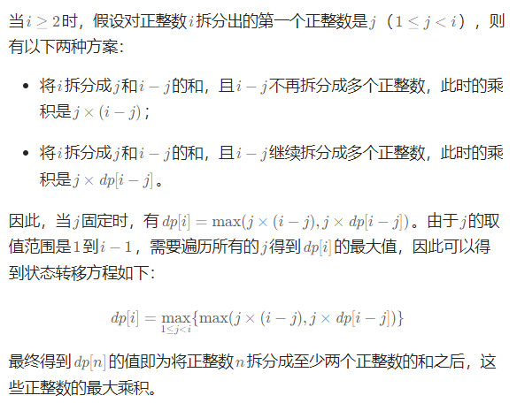
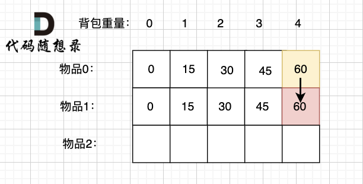
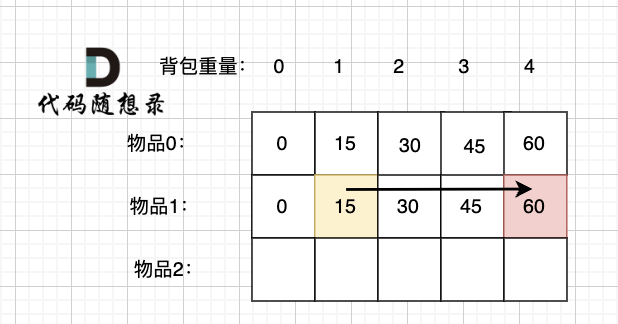
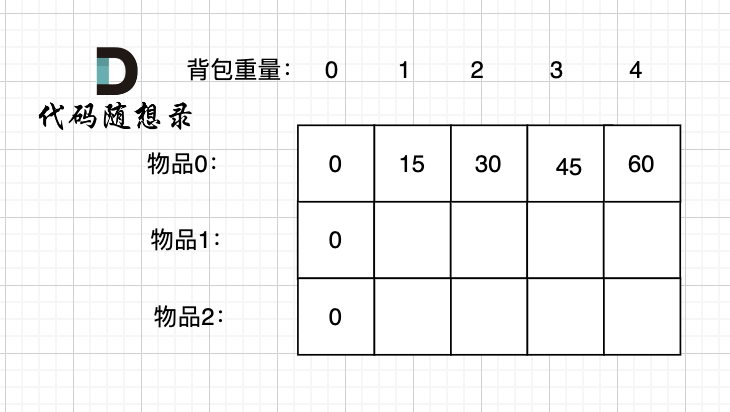

**高频**：DP

**如果某一问题有很多重叠子问题，使用动态规划是最有效的。**

所以动态规划中**每一个状态一定是由上一个状态推导**出来的，**这一点就区分于贪心**，贪心没有状态推导，而是从局部直接选最优的

例如：有N件物品和一个最多能背重量为W 的背包。第i件物品的重量是weight[i]，得到的价值是value[i] 。**每件物品只能用一次**，求解将哪些物品装入背包里物品价值总和最大。

动态规划中dp[j]是由dp[j-weight[i]]推导出来的，然后取max(dp[j], dp[j - weight[i]] + value[i])。

**状态转移公式**

1. 确定dp数组（dp table）以及下标的含义
2. 确定递推公式
3. dp数组如何初始化
4. 确定遍历顺序
5. 举例推导dp数组


### 509.斐波那契数列 easy

如果是用递归来做的话： $O(2^n)$

状态转移公式：dp[index] = dp[index-1] + dp[index-2]

把每一步算出来的都存在数组里面就好了， $O(n)$

```java
class Solution {
    public int fib(int n) {
        if(n<=1) return n;
        int[] dp = new int[n+1];
        dp[0] = 0 ;
        dp[1] = 1;
        for(int index=2;index<=n;index++){
            dp[index] = dp[index-1] + dp[index-2];
        } 
        return dp[n];
            }
}
```

### 70.爬楼梯

假设你正在爬楼梯。需要 `n` 阶你才能到达楼顶。

每次你可以爬 `1` 或 `2` 个台阶。你有多少种不同的方法可以爬到楼顶呢？

**如果迈出的是一级楼梯，那么接下来还有(20-1) = 19级楼梯要爬，19级楼梯的爬楼有f(19)种方法。**

**如果迈出的是二级楼梯，那么接下来还有(20-2) = 18级楼梯要爬，18级楼梯的爬楼有f(18)种方法。**

所以说还是**斐波那契数列问题**

```java
class Solution {
    public int climbStairs(int n) {
        int[] dp = new int[n+1];
        dp[0] = 1;
        dp[1] = 1;
        // dp[2] = 2;
        for(int i =2;i<=n;i++){
            dp[i] = dp[i-1] + dp[i-2];
        }
        return dp[n];
        }
    }
```


### 118.杨辉三角

把每行的数都对齐一下：

1

1,1

1,2,1

1,3,3,1

1,4,6,4,1

一排的第一个数和最后一个数都是 1

其余数字等于左上角加上正上方


```java
class Solution {
    public List<List<Integer>> generate(int numRows) {
        List<List<Integer>> c = new ArrayList<>(numRows);
        c.add(List.of(1));
        for(int i =1;i<numRows;i++){
            List<Integer> row = new ArrayList<>(i+1);
            row.add(1); //第一个
            //中间的
            for(int j=1;j<i;j++){
                row.add(c.get(i-1).get(j-1)+c.get(i-1).get(j));
            }
            row.add(1); //最后一个
            c.add(row);
        }
        return c;

    }
}
```


### 198.打家劫舍  M

第一步确定dp的概念： dp[i]：从前i家中偷东西

2.递推关系：


```java
class Solution {
    public int rob(int[] nums) {
        int n = nums.length;
        int[] dp = new int[n+1];
        dp[0] = 0;
        dp[1] = nums[0];
        for(int i=2;i<=nums.length;i++){
            dp[i] = Math.max(dp[i-1],dp[i-2]+nums[i-1]);
        }
        return dp[n];
    }
}
```


**如果要输出路径**

**dp数组定义：dp[i] [0]代表不偷第i号房屋所能获得最大金额**

**dp[i] [1]代表偷第i号房屋所能获得最大金额**

递推公式：不偷第i号房屋所能获得最大金额就是一定得偷第i号房屋也就是dp[i] [0] = dp[i - 1] [1]
偷第i号房屋所能获得最大金额有两种情况：

偷i-2号房屋，这个好理解
不偷i-2号房屋，比如说[2，1，1，2]
两者取最大的，也就是dp[i] [1] = Math.max(dp[i - 2] [1] + nums[i], dp[i - 2] [0] + nums[i])
计算路径：得出dp数组后，因为是要计算偷了那几家，因此路径一定是偷了的那家，也就是dp[i] [1]，然后倒序遍历，如果偷了第i家的最大金额等于target，那就记录路径


```java
class Solution {
   public List<Integer> rob(int[] nums) {
      if (nums.length == 1) {
         return nums[0];
      }
      int[][] dp = new int[nums.length][2];
      dp[0][0] = 0;
      dp[0][1] = nums[0];
      dp[1][0] = nums[0];
      dp[1][1] = nums[1];
      for (int i = 2; i < nums.length; i++) {
         dp[i][0] = dp[i - 1][1];
         dp[i][1] = Math.max(dp[i - 2][1] + nums[i], dp[i - 2][0] + nums[i]);
      }
      int target = Math.max(dp[nums.length - 1][0],dp[nums.length - 1][1]);
      List<Integer> track = new ArrayList<>();
      for (int i = nums.length - 1; i >= 0; i--) {
         if (dp[i][1] == target) {
            target = target - nums[i];
            track.add(nums[i]);
         }
      }
      Collections.reverse(track);
      return track;
   }
}
```


### 62.不同路径 M

dp[i] [j]：表示从（0 ，0）出发，到(i, j) 有条不同的路径。

想要求dp[i] [j]，只能有两个方向来推导出来，即dp[i - 1] [j] 和 dp[i] [j - 1]。


```java
class Solution {
    public int uniquePaths(int m, int n) {
        int[][] dp = new int[m][n];
        for(int i=0;i<m;i++) dp[i][0] = 1;
        for(int i=0;i<n;i++) dp[0][i] = 1;

        for(int i=1;i<m;i++){
             for(int j=1;j<n;j++){
                dp[i][j] = dp[i][j-1] + dp[i-1][j];
             }
        }
        return dp[m-1][n-1];
    }
}
```


### 63.不同路径|| M

相比上一道题加了一个障碍物

那么有障碍物的地方就过不去了，只考虑这部分就可以了。

```java
class Solution {
    public int uniquePathsWithObstacles(int[][] obstacleGrid) {
        int m = obstacleGrid.length;
        int n =obstacleGrid[0].length;
        int[][] dp = new int[m][n];
        // 如果起点终点就有了障碍物
        // 1 障碍物 0 正常
        if(obstacleGrid[0][0] == 1 || obstacleGrid[m-1][n-1] == 1){
            return 0;
        }
        // 循环条件是关键
        for(int i=0;i<m && obstacleGrid[i][0] == 0;i++) {
            dp[i][0] = 1;  //不是每个[i][0] 都能到达
        }
        for(int i=0;i<n && obstacleGrid[0][i] == 0;i++) {
            dp[0][i] = 1;  //不是每个[i][0] 都能到达
        }
         for(int i=1;i<m;i++){
             for(int j=1;j<n;j++){
                dp[i][j] = (obstacleGrid[i][j] ==0) ? dp[i][j-1] + dp[i-1][j] : 0;
             }
        }
        return dp[m-1][n-1];
    }
}
```


### 343.整数拆分 M




```java
class Solution {
    public int integerBreak(int n) {
        // 拆成k个正整数，返回乘积最大值
        int[] dp = new int[n+1];
        dp[2] = 1;
        for(int i=3;i<=n;i++){
            for (int j = 1; j < i - 1; j++) {
                dp[i] = Math.max(dp[i], Math.max(j*(i-j), j*dp[i-j]));
            }
        }
        return dp[n];
    }
}
```


## 0-1 背包问题

// 二维数组

有n件物品和一个最多能背重量为w 的背包。第i件物品的重量是weight[i]，得到的价值是value[i] 。**每件物品只能用一次**，求解将哪些物品装入背包里物品价值总和最大。

```java
public class Main {
    public static void main(String[] args) {
        Scanner scanner = new Scanner(System.in);
        int n = scanner.nextInt();
        int bagweight = scanner.nextInt();

        int[] weight = new int[n];
        int[] value = new int[n];

        for (int i = 0; i < n; ++i) {
            weight[i] = scanner.nextInt();
        }
        for (int j = 0; j < n; ++j) {
            value[j] = scanner.nextInt();
        }

        int[][] dp = new int[n][bagweight + 1];

        for (int j = weight[0]; j <= bagweight; j++) {
            dp[0][j] = value[0];
        }

        for (int i = 1; i < n; i++) {
            for (int j = 0; j <= bagweight; j++) {
                if (j < weight[i]) {
                     // 当前背包容量 j 小于第 i 个物品的重量，无法放入第 i 个物品
            		// 所以最大价值等于前 i - 1 个物品在容量 j 下的最大价值
                    dp[i][j] = dp[i - 1][j];
                } else {
                    // 当前背包容量 j 大于等于第 i 个物品的重量，可以选择放入或不放入第 i 个物品
                    // 不放入第 i 个物品时，最大价值为 dp[i - 1][j]
                    // 放入第 i 个物品时，需要先留出第 i 个物品的重量，即前 i - 1 个物品在容量 j - weight[i] 下的最大价值加上第 i 个物品的价值
                    // 取两者中的最大值作为 dp[i][j] 的值
                    dp[i][j] = Math.max(dp[i - 1][j], dp[i - 1][j - weight[i]] + value[i]);
                }
            }
        }

        System.out.println(dp[n - 1][bagweight]);
    }
}

```

//一维数组

```java
// 创建一个动态规划数组 dp，初始值为 0
        int[] dp = new int[N + 1];

        // 外层循环遍历每个类型的研究材料
        for (int i = 0; i < M; i++) {
            // 倒序 内层循环从 N 空间逐渐减少到当前研究材料所占空间
            for (int j = N; j >= costs[i]; j--) {
                // 考虑当前研究材料选择和不选择的情况，选择最大值
                dp[j] = Math.max(dp[j], dp[j - costs[i]] + values[i]);
            }
        }

        // 输出 dp[N]，即在给定 N 行李空间可以携带的研究材料的最大价值
        System.out.println(dp[N]);
```


### 416\. 分割等和子集
------------

给你一个 **只包含正整数** 的 **非空** 数组 `nums` 。请你判断是否可以将这个数组分割成两个子集，使得两个子集的元素和相等。

**示例 1：**

**输入：**nums = \[1,5,11,5\]
**输出：**true
**解释：**数组可以分割成 \[1, 5, 5\] 和 \[11\] 。


其实还是一个一维背包问题变式 而且 重量 = 价值

```java
class Solution {
    public boolean canPartition(int[] nums) {
        // 分割成两个子集，元素和相等
        int total = sum(nums);
        // 有一个只能装重量为 sum / 2 的背包，商品为数字，这些数字能不能把 这个背包装满。 dp[target]
        if(total % 2 != 0) return false;
        int target = total / 2;
        int[] dp = new int[target + 1];
        for(int i=0;i<nums.length;i++){
            for(int j=target;j>=nums[i];j--){
                dp[j] = Math.max(dp[j], dp[j-nums[i]] + nums[i]);
            }
            if(dp[target] == target)
                return true;
        }
        return false;
    }

    public int sum(int[] nums){
        int ss = 0;
        for(int i=0;i<nums.length;i++){
            ss += nums[i];
        }
        return ss;
    }
}
```


### 1049\. 最后一块石头的重量 II
-------------------

有一堆石头，用整数数组 `stones` 表示。其中 `stones[i]` 表示第 `i` 块石头的重量。

每一回合，从中选出**任意两块石头**，然后将它们一起粉碎。假设石头的重量分别为 `x` 和 `y`，且 `x <= y`。那么粉碎的可能结果如下：

*   如果 `x == y`，那么两块石头都会被完全粉碎；
*   如果 `x != y`，那么重量为 `x` 的石头将会完全粉碎，而重量为 `y` 的石头新重量为 `y-x`。

最后，**最多只会剩下一块** 石头。返回此石头 **最小的可能重量** 。如果没有石头剩下，就返回 `0`。


**思路**

一堆的石头重量是sum，那么我们就尽可能拼成 重量为 sum / 2 的石头堆。 

这样剩下的石头堆也是 尽可能接近 sum/2 的重量。 那么此时问题就是有一堆石头，每个石头都有自己的重量，是否可以装满 最大重量为 sum / 2的背包。

```java
class Solution {
    public int lastStoneWeightII(int[] stones) {

        int sum = 0;
        for (int i : stones) {
            sum += i;
        }
        int target = sum >> 1;
        int[] dp = new int[target+1];
        for(int i=0;i<stones.length;i++){
            for(int j=target;j>=stones[i];j--){
                dp[j] = Math.max(dp[j], dp[j - stones[i]] + stones[i]);
            }
        }
        return sum - 2*dp[target];
    }
}
```


### 494\. 目标和
---------

给你一个非负整数数组 `nums` 和一个整数 `target` 。

向数组中的每个整数前添加 `'+'` 或 `'-'` ，然后串联起所有整数，可以构造一个 **表达式** ：

*   例如，`nums = [2, 1]` ，可以在 `2` 之前添加 `'+'` ，在 `1` 之前添加 `'-'` ，然后串联起来得到表达式 `"+2-1"` 。

返回可以通过上述方法构造的、运算结果等于 `target` 的不同 **表达式** 的数目。

**示例 1：**

**输入：**nums = \[1,1,1,1,1\], target = 3
**输出：**5
**解释：**一共有 5 种方法让最终目标和为 3 。
-1 + 1 + 1 + 1 + 1 = 3
+1 - 1 + 1 + 1 + 1 = 3
+1 + 1 - 1 + 1 + 1 = 3
+1 + 1 + 1 - 1 + 1 = 3
+1 + 1 + 1 + 1 - 1 = 3


- 思路

假设加法的总和为x，那么减法对应的总和就是sum - x。

所以我们要求的是 x - (sum - x) = target

x = (target + sum) / 2

**所以问题就变成了从nums中找出一些数字满足这个条件**

 dp[j]，表示：填满j（包括j）这么大容积的包，有dp[j]种方法

二维DP数组递推公式： `dp[i][j] = dp[i - 1][j] + dp[i - 1][j - nums[i]];`

**不选择当前元素 `nums[i]`**  和 **选择当前元素 `nums[i]`**

去掉维度i 之后，递推公式：`dp[j] = dp[j] + dp[j - nums[i]]` ，即：`dp[j] += dp[j - nums[i]]`


```java
class Solution {
    public int findTargetSumWays(int[] nums, int target) {
        // 非负整数数组 nums
        int sum = 0;
        for(int num : nums){
            sum += num;
        }
        if(Math.abs(target) > sum) return 0;
        if(((sum + target) %2 !=0)) return 0;
        int bagsize = (sum + target) / 2;
        int[] dp = new int[bagsize+1];
        dp[0] = 1;
        for(int i=0;i<nums.length;i++){
            for(int j=bagsize;j>=nums[i];j--){
                //dp[j] = dp[j] + dp[j-nums[i]];
                dp[j] += dp[j - nums[i]];
            }
        }
        return dp[bagsize];
    }
}
```


### 474\. 一和零
---------

给你一个二进制字符串数组 `strs` 和两个整数 `m` 和 `n` 。

请你找出并返回 `strs` 的最大子集的长度，该子集中 **最多** 有 `m` 个 `0` 和 `n` 个 `1` 。

如果 `x` 的所有元素也是 `y` 的元素，集合 `x` 是集合 `y` 的 **子集** 。

**示例 1：**

**输入：**strs = \["10", "0001", "111001", "1", "0"\], m = 5, n = 3
**输出：**4
**解释：**最多有 5 个 0 和 3 个 1 的最大子集是 {"10","0001","1","0"} ，因此答案是 4 。
其他满足题意但较小的子集包括 {"0001","1"} 和 {"10","1","0"} 。{"111001"} 不满足题意，因为它含 4 个 1 ，大于 n 的值 3 。


还是一个0 1 背包问题

字符串的zeroNum和oneNum相当于物品的重量（weight[i]），字符串本身的个数相当于物品的价值（value[i]）。

**这就是一个典型的01背包！** 只不过物品的重量有了两个维度而已。

```java
class Solution {
    public int findMaxForm(String[] strs, int m, int n) {
        // 二进制字符串数组 最多有m个0和n个1
        int[][] dp = new int[m+1][n+1];
        int one;
        int zero;
        for(String str : strs){
            one = 0;
            zero = 0;
            for(char c : str.toCharArray()){
                if(c == '0')  zero++;
                else one++;
            }
            for (int i = m; i >= zero; i--) {
                for (int j = n; j >= one; j--) {
                    dp[i][j] = Math.max(dp[i][j], dp[i-zero][j-one] + 1);
                }
        }
    }
    return dp[m][n];
}
}
```


### 完全背包

有N件物品和一个最多能背重量为W的背包。第i件物品的重量是weight[i]，得到的价值是value[i] 。**每件物品都有无限个（也就是可以放入背包多次）**，求解将哪些物品装入背包里物品价值总和最大。

**完全背包和01背包问题唯一不同的地方就是，每种物品有无限件**。


**分析**

**1.确定dp数组下标含义**

dp[i] [j]表示从下标为[0-i]的物品，每个物品可以取无限次，放进容量为j的背包，价值总和最大是多少

求取 dp[1] [4]有两种情况：

1. 放物品1
2. 还是不放物品1

如果不放物品1， 那么背包的价值应该是 dp[0] [4] 即 容量为4的背包，只放物品0的情况。



如果放物品1， **那么背包要先留出物品1的容量**，目前容量是4，物品1 的容量（就是物品1的重量）为3，此时背包剩下容量为1。

容量为1，只考虑放物品0 和物品1 的最大价值是 **dp[1] [1]**

在完全背包中，物品是可以放无限个，所以 即使空出物品1空间重量，那背包中也可能还有物品1，所以此时我们依然考虑放 物品0 和 物品1 的最大价值即： **dp[1] [1]， 而不是 dp[0] [1]**

所以 放物品1 的情况 = dp[1] [1] + 物品1 的价值，推导方向如图：



```c
dp[1][4] = max(dp[0][4], dp[1][1] + 物品1 的价值);
    
可以类推抽象公式为：
dp[i][j] = max(dp[i-1][j], dp[i][j-weight[i]] + value[j]);

01背包中是 dp[i - 1][j - weight[i]] + value[i])
```


**2.初始化**



**3.确定遍历顺序**


在01背包问题中，先遍历物品 重量都是可以的

**二维数组：**

```java
 import java.util.Scanner;

public class Main {
    public static void main(String[] args) {
 Scanner scanner = new Scanner(System.in);
        int n = scanner.nextInt();
        int bagWeight = scanner.nextInt();

        int[] weight = new int[n];
        int[] value = new int[n];

        for (int i = 0; i < n; i++) {
            weight[i] = scanner.nextInt();
            value[i] = scanner.nextInt();
        }

        int[][] dp = new int[n][bagWeight + 1];
        // 初始化
        for(int i=weight[0];i<=bagWeight;i++){
            dp[0][i] = dp[0][i-weight[0]] + value[0];
        }
        
        //动态规划
        for(int i=1;i<n;i++){
            for(int j=0;j<=bagWeight;j++){
                if(j<weight[i]) dp[i][j] = dp[i-1][j];
                else{
                    dp[i][j] = Math.max(dp[i-1][j], dp[i][j-weight[i]] + value[i]);
                }
            }
            
        }
        System.out.println(dp[n - 1][bagWeight]);
        scanner.close();
    }
}
```

**一维数组：**

```c
压缩成一维DP数组，也就是将上一层拷贝到当前层。

将上一层dp[i-1] 的那一层拷贝到 当前层 dp[i] ，那么 递推公式由：
    dp[i][j] = max(dp[i - 1][j], dp[i][j - weight[i]] + value[i]) 
    变成： dp[i][j] = max(dp[i][j], dp[i][j - weight[i]] + value[i])

我们压缩成一维dp数组，去掉 i 层数维度。
即：dp[j] = max(dp[j], dp[j - weight[i]] + value[i])
```

但如果题目稍稍有点变化，就会体现在**遍历顺序**上。

如果问装满背包有几种方式的话？ 那么两个for循环的先后顺序就有很大区别了，而leetcode上的题目都是这种稍有变化的类型。


**如果求组合数就是外层for循环遍历物品，内层for遍历背包**。**（不在意顺序）**

**如果求排列数就是外层for遍历背包，内层for循环遍历物品**。	**（顺序很关键）**

```java
int[] dp = new int[bagWeight + 1];

        for (int j = 0; j <= bagWeight; j++) { // 遍历背包容量
            for (int i = 0; i < weight.length; i++) { // 遍历物品
                if (j >= weight[i]) {
                    dp[j] = Math.max(dp[j], dp[j - weight[i]] + value[i]);
                }
            }
        }
```

```java
// 先遍历物品
        for (int i = 0; i < weight.length; i++) { 
            // 再遍历背包容量
            for (int j = bagWeight; j >= weight[i]; j--) { 
                dp[j] = Math.max(dp[j], dp[j - weight[i]] + value[i]);
            }
        }
```


### 377\. 组合总和 Ⅳ

------------

给你一个由 **不同** 整数组成的数组 `nums` ，和一个目标整数 `target` 。请你从 `nums` 中找出并返回总和为 `target` 的元素组合的个数。

题目数据保证答案符合 32 位整数范围。

**示例 1：**

**输入：**nums = \[1,2,3\], target = 4
**输出：**7
**解释：**
所有可能的组合为：
(1, 1, 1, 1)
(1, 1, 2)
(1, 2, 1)
(1, 3)
(2, 1, 1)
(2, 2)
(3, 1)
请注意，顺序不同的序列被视作不同的组合。


**这题是排列**

所以本题遍历顺序最终遍历顺序：**target（背包）放在外循环，将nums（物品）放在内循环，内循环从前到后遍历**。


**其实应该把这道题看成爬楼梯也可以**

```java
public int combinationSum4(int[] nums, int target) {
        // 定义dp[i]为爬上i层的方案数
        // 最后一次可以决策爬 nums[j]层，则dp[i] = sum(dp[i - nums[j]])
        int[] dp = new int[target + 1];
        dp[0] = 1;
        for (int i = 1; i <= target; i++) {
            for (int n : nums) {
                if (i >= n) {
                    dp[i] += dp[i - n];
                }
            }
        }
        return dp[target];
    }
```


### 518\. 零钱兑换 II
-------------

给你一个整数数组 `coins` 表示不同面额的硬币，另给一个整数 `amount` 表示总金额。

请你计算并返回可以凑成总金额的硬币组合数。如果任何硬币组合都无法凑出总金额，返回 `0` 。

假设每一种面额的硬币有无限个。 

题目数据保证结果符合 32 位带符号整数。

**示例 1：**

**输入：**amount = 5, coins = \[1, 2, 5\]
**输出：**4
**解释：**有四种方式可以凑成总金额：
5=5
5=2+2+1
5=2+1+1+1
5=1+1+1+1+1

**这题和494 目标和其实差不多，就是改成了完全背包问题**

```java
class Solution {
    public int change(int amount, int[] coins) {
        // 这不就是完全背包问题吗  求组合数就是外层for循环遍历物品，内层for遍历背包
        int[] dp = new int[amount+1];
        dp[0] = 1;
        for(int i=0;i<coins.length;i++){
            // 遍历的条件判断和01背包有不同
             for (int j = coins[i]; j <= amount; j++){
                //dp[j] = Math.max(dp[j], dp[j-coins[i]] + coins[i]);
                dp[j] = dp[j] + dp[j-coins[i]];
            }
        }
        return dp[amount];
    }
}
```


### 279\. 完全平方数
-----------

给你一个整数 `n` ，返回 _和为 `n` 的完全平方数的最少数量_ 。

**完全平方数** 是一个整数，其值等于另一个整数的平方；换句话说，其值等于一个整数自乘的积。例如，`1`、`4`、`9` 和 `16` 都是完全平方数，而 `3` 和 `11` 不是。

**示例 1：**

**输入：**n = `12`
**输出：**3 
**解释：**`12 = 4 + 4 + 4`


这其实也是完全背包问题的变式，这题里 先遍历那种都是可以的

```java
public int numSquares(int n) {
        // 完全平方数 和为 n 的完全平方数的最少数量
        int max = Integer.MAX_VALUE;
        int[] dp = new int[n+1];
        Arrays.fill(dp,max);
        dp[0] = 0;
        // n 是背包 平方数是物品
        for(int i=1;i*i<=n;i++){
            for(int j=i*i;j<=n;j++){
                dp[j] = Math.min(dp[j], dp[j-i*i]+1);
            }
        }
        return dp[n];
    }
```


```java
// 遍历背包
        for (int j = 1; j <= n; j++) {
            // 遍历物品
            for (int i = 1; i * i <= j; i++) {
                dp[j] = Math.min(dp[j], dp[j - i * i] + 1);
            }
        }
```


### 139\. 单词拆分
----------

给你一个字符串 `s` 和一个字符串列表 `wordDict` 作为字典。如果可以利用字典中出现的一个或多个单词拼接出 `s` 则返回 `true`。

**注意：**不要求字典中出现的单词全部都使用，并且字典中的单词可以重复使用。

**示例 1：**

**输入:** s = "leetcode", wordDict = \["leet", "code"\]
**输出:** true
**解释:** 返回 true 因为 "leetcode" 可以由 "leet" 和 "code" 拼接成。


两种解法： 1.记忆法递归  2.完全背包问题

```java
class Solution {
    public boolean wordBreak(String s, List<String> wordDict) {
/*
        Set<String> wordSet = new HashSet<>(wordDict);
        boolean[] memory = new boolean[s.length()];
        // 默认都可以被拆分
        Arrays.fill(memory, true);
        // 从字符串的起始位置开始调用回溯函数
        return backtracking(s, wordSet, memory, 0);
        
*/

    //完全背包解法 单词就是物品，字符串s就是背包，单词能否组成字符串s
    // 这里求得其实是排列数 所以先遍历背包，再遍历物品
    HashSet<String> set = new HashSet<>(wordDict);
    boolean[] valid = new boolean[s.length() + 1];
    valid[0] = true;

    for(int i=1;i<=s.length();i++){
        for(int j=0;j < i && !valid[i];j++){
            if (set.contains(s.substring(j, i)) && valid[j]) {
                    valid[i] = true;
                }
        }
    }
        return valid[s.length()];
    }

// 回溯法  记忆法递归
    public boolean backtracking(String s, Set<String> wordSet, boolean[] memory, int startIndex){
        // 如果 startIndex 大于等于字符串 s 的长度，说明已经成功分割完整个字符串
        if (startIndex >= s.length()) {
            return true;
        }
        // 如果 memory[startIndex] 已经被标记为 false，说明从 startIndex 开始的子串无法被拆分
        if (!memory[startIndex]) {
            return false;
        }
        // 从 startIndex 开始尝试不同的分割点
        for (int i = startIndex; i < s.length(); i++) {
            String word = s.substring(startIndex, i + 1);
            // 如果截取的子字符串在字典中，并且从 i + 1 开始也能成功分割
            if (wordSet.contains(word) && backtracking(s, wordSet, memory, i + 1)) {
                return true;
            }
        }
        // 记录以 startIndex 开始的子串是不可以被拆分的
        memory[startIndex] = false;
        return false;
}
}
```


## 动态规划之子序列问题

子序列问题是动态规划解决的经典问题


### 300.最长递增子序列
-------------

给你一个整数数组 `nums` ，找到其中最长严格递增子序列的长度。

**子序列** 是由数组派生而来的序列，删除（或不删除）数组中的元素而不改变其余元素的顺序。例如，`[3,6,2,7]` 是数组 `[0,3,1,6,2,2,7]` 的子序列。

**示例 1：**

**输入：**nums = \[10,9,2,5,3,7,101,18\]
**输出：**4
**解释：**最长递增子序列是 \[2,3,7,101\]，因此长度为 4 。


**这题想清楚了dp数组的含义就清晰了很多**

**dp[i]含义 以i结尾的子序列的最大长度 -**

```java
public int lengthOfLIS(int[] nums) {
        if(nums.length == 0) return 0;
        // 子序列 可以删除元素但不改变元素顺序
        // dp[i]含义 以i结尾的子序列的最大长度
        int[] dp = new int[nums.length+1];
        Arrays.fill(dp,1); // 默认都是长度为1
        //要注意这题的最终结果并不是 dp[nums.length]，要注意dp数组的含义
        int max = Integer.MIN_VALUE;
        for(int i=0;i<nums.length;i++){
            // 搜索 j - i
            for(int j=0;j<i;j++){
                if(nums[i] > nums[j]) dp[i] = Math.max(dp[i], dp[j] + 1);
            }
            max = Math.max(max,dp[i]);
        }
        return max;
    }
```


### 674.最长连续递增序列
--------------

给定一个未经排序的整数数组，找到最长且 **连续递增的子序列**，并返回该序列的长度。

**连续递增的子序列** 可以由两个下标 `l` 和 `r`（`l < r`）确定，如果对于每个 `l <= i < r`，都有 `nums[i] < nums[i + 1]` ，那么子序列 `[nums[l], nums[l + 1], ..., nums[r - 1], nums[r]]` 就是连续递增子序列。

**示例 1：**

**输入：**nums = \[1,3,5,4,7\]
**输出：**3
**解释：**最长连续递增序列是 \[1,3,5\], 长度为3。
尽管 \[1,3,5,7\] 也是升序的子序列, 但它不是连续的，因为 5 和 7 在原数组里被 4 隔开。 


**和上一题最大的区别在于“连续”。**

如果 nums[i] > nums[i - 1]，那么以 i 为结尾的连续递增的子序列长度 一定等于 以i - 1为结尾的连续递增的子序列长度 + 1 。

即：dp[i] = dp[i - 1] + 1;

因为本题要求连续递增子序列，所以就只要比较nums[i]与nums[i - 1]，而不用去比较nums[j]与nums[i] （j是在0到i之间遍历）。

**既然不用j了，那么也不用两层for循环，本题一层for循环就行**，比较nums[i] 和 nums[i - 1]。

```java
 public int findLengthOfLCIS(int[] nums) {
        // 这题要求子序列是连续的
        // dp[i] 表示 到i的最长递增子序列
        if(nums.length == 1) return 1;
        int[] dp = new int[nums.length + 1];
        Arrays.fill(dp,1);
        int max = 0;
        for(int i=1;i<nums.length;i++){
            if(nums[i] > nums[i-1]) dp[i] = dp[i-1] + 1;
            max = Math.max(max,dp[i]);
        }
        return max;
    }
```


### 1143\. 最长公共子序列
--------------

给定两个字符串 `text1` 和 `text2`，返回这两个字符串的最长 **公共子序列** 的长度。如果不存在 **公共子序列** ，返回 `0` 。

一个字符串的 **子序列** 是指这样一个新的字符串：它是由原字符串在不改变字符的相对顺序的情况下删除某些字符（也可以不删除任何字符）后组成的新字符串。

*   例如，`"ace"` 是 `"abcde"` 的子序列，但 `"aec"` 不是 `"abcde"` 的子序列。

两个字符串的 **公共子序列** 是这两个字符串所共同拥有的子序列。

**示例 1：**

**输入：**text1 = "abcde", text2 = "ace" 
**输出：**3  
**解释：**最长公共子序列是 "ace" ，它的长度为 3 。


### 152\. 乘积最大子数组

-------------

给你一个整数数组 `nums` ，请你找出数组中乘积最大的非空连续 子数组（该子数组中至少包含一个数字），并返回该子数组所对应的乘积。

测试用例的答案是一个 **32-位** 整数。

**示例 1:**

**输入:** nums = \[2,3,-2,4\]
**输出:** `6`
**解释:** 子数组 \[2,3\] 有最大乘积 6。


- 遍历数组时计算当前最大值，不断更新
- 令imax为当前最大值，则当前最大值为 imax = max(imax * nums[i], nums[i])
- **由于存在负数，那么会导致最大的变最小的，最小的变最大的。因此还需要维护当前最小值imin，imin = min(imin * nums[i], nums[i])**
- 当负数出现时则imax与imin进行交换再进行下一步计算

```java
public int maxProduct(int[] nums) {
        // dp[i]  i结尾的最大乘积
        // 存在负数
        int imax = 1, imin = 1;
        int max = Integer.MIN_VALUE;
        for(int i=0;i<nums.length;i++){
            if(nums[i] < 0){
                int temp = imax;
                imax = imin;
                imin = temp;
            }
            imax = Math.max(imax*nums[i], nums[i]);
            imin = Math.min(imin*nums[i], nums[i]);

            max = Math.max(max,imax);
        }
        return max;
    }
```


### 5.最长回文子串
----------

给你一个字符串 `s`，找到 `s` 中最长的 回文 子串。

**示例 1：**

**输入：**s = "babad"
**输出：**"bab"
**解释：**"aba" 同样是符合题意的答案。


### 516.最长回文子序列
-------------

给你一个字符串 `s` ，找出其中最长的回文子序列，并返回该序列的长度。

子序列定义为：不改变剩余字符顺序的情况下，删除某些字符或者不删除任何字符形成的一个序列。

**示例 1：**

**输入：**s = "bbbab"
**输出：**4
**解释：**一个可能的最长回文子序列为 "bbbb" 。


### 647.回文子串
----------

给你一个字符串 `s` ，请你统计并返回这个字符串中 **回文子串** 的数目。

**回文字符串** 是正着读和倒过来读一样的字符串。

**子字符串** 是字符串中的由连续字符组成的一个序列。

**示例 1：**

**输入：**s = "abc"
**输出：**3
**解释：**三个回文子串: "a", "b", "c"


