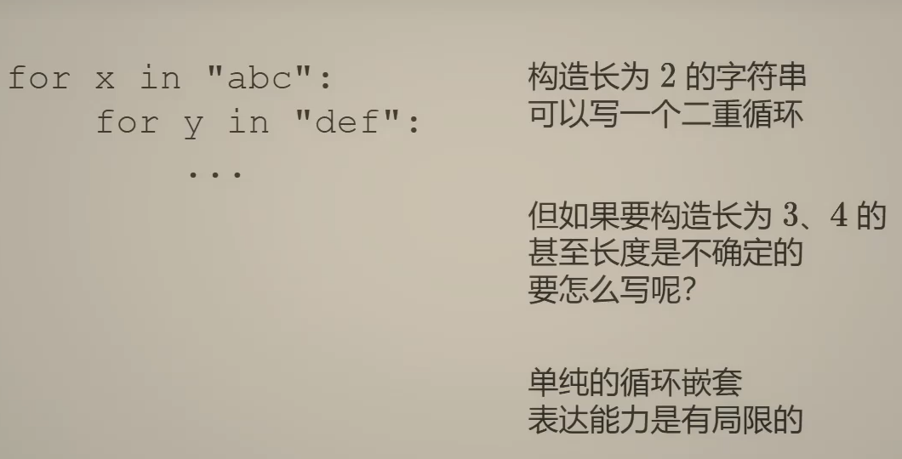
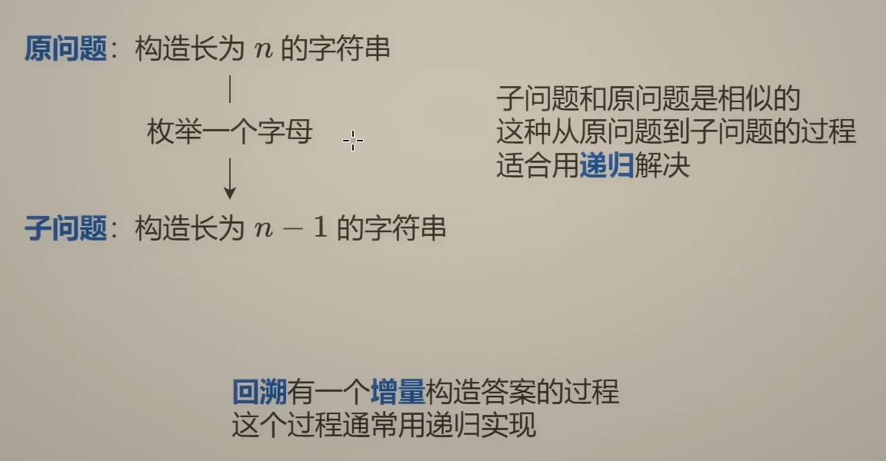
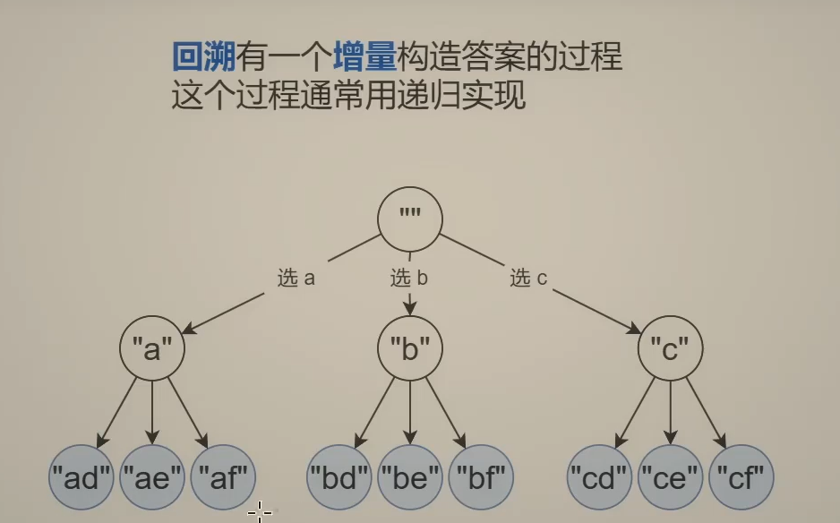
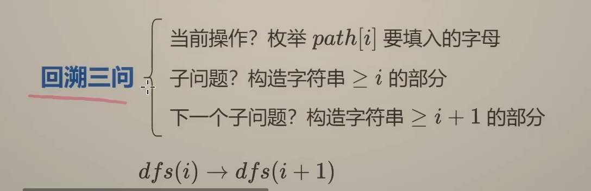
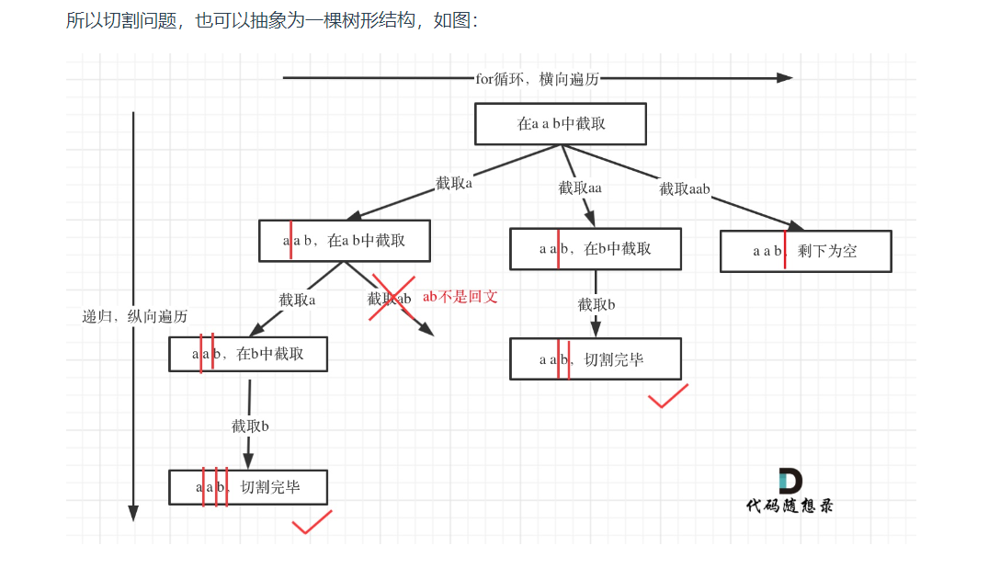

**回溯的本质是穷举，穷举所有可能，然后选出我们想要的答案**，如果想让回溯法高效一些，可以加一些剪枝的操作，但也改不了回溯法就是穷举的本质。

回溯模板：

```
void backtracking(参数) {
    if (终止条件) {
        存放结果;
        return;
    }

    for (选择：本层集合中元素（树中节点孩子的数量就是集合的大小）) {
        处理节点;
        backtracking(路径，选择列表); // 递归
        回溯，撤销处理结果
    }
}

```


 #### 回溯法解决的问题

- 组合问题：N个数里面按一定规则找出k个数的集合
- 切割问题：一个字符串按一定规则有几种切割方式
- 子集问题：一个N个数的集合里有多少符合条件的子集
- 排列问题：N个数按一定规则全排列，有几种排列方式
- 棋盘问题：N皇后，解数独等等



递归：



回溯特点：增量构造



重点在于 **边界条件和非边界条件逻辑**   

回溯三问：



就是在做深度优先搜索


#### 17\. 电话号码的字母组合

--------------

[https://leetcode.cn/problems/letter-combinations-of-a-phone-number/solutions/?envType=study-plan-v2&envId=top-100-liked](https://leetcode.cn/problems/letter-combinations-of-a-phone-number/solutions/?envType=study-plan-v2&envId=top-100-liked) 

给定一个仅包含数字 `2-9` 的字符串，返回所有它能表示的字母组合。答案可以按 **任意顺序** 返回。给出数字到字母的映射如下（与电话按键相同）。注意 1 不对应任何字母。


```java
class Solution {
    // 0 1 2 3 4 5 6 7 8 9 
    private static final String[] MAPPING = new String[]{"", "", "abc", "def", "ghi", "jkl", "mno", "pqrs", "tuv", "wxyz"};
    private char[] digits;
    private char[] path;
    List<String> ans = new ArrayList<>();
    // digits "23"
    public List<String> letterCombinations(String digits) {
        int n = digits.length();
        if(n == 0) return ans;
        path = new char[n];
        this.digits = digits.toCharArray();
        dfs(0);
        return ans;
}
    public void dfs(int i){
        // 终止条件，走完了一轮
        if(i == digits.length){
            ans.add(new String(path));
            return;
        }
        for(char c : MAPPING[digits[i] - '0'].toCharArray()){
            path[i] = c;
            dfs(i+1);
        }
    }
}
```


#### 77\. 组合

-------

给定两个整数 `n` 和 `k`，返回范围 `[1, n]` 中所有可能的 `k` 个数的组合。

你可以按 **任何顺序** 返回答案。

```java
class Solution {
    private final List<List<Integer>> ans = new ArrayList<>();
    private final List<Integer> path = new ArrayList<>();

    public List<List<Integer>> combine(int n, int k) {
        dfs(n,k,1);
        return ans;
    }
    // startIndex表示从数字1 2 3 ... 开始
    public void dfs(int n,int k,int startIndex){
        if(path.size() == k){
            ans.add(new ArrayList<>(path));
            return;
        }
        //剪枝优化
        //每次从集合中选取元素，可选择的范围随着选择的进行而收缩
        for(int i = startIndex;i<= n-(k-path.size()) + 1;i++){
      //  for(int i=startIndex;i<=n;i++){
            path.add(i);
            dfs(n,k,i+1);
            path.removeLast();
        }
        }
}
```


#### 39\. 组合总和

---------

给你一个 **无重复元素** 的整数数组 `candidates` 和一个目标整数 `target` ，找出 `candidates` 中可以使数字和为目标数 `target` 的 所有 **不同组合** ，并以列表形式返回。你可以按 **任意顺序** 返回这些组合。`candidates` 中的 **同一个** 数字可以 **无限制重复被选取** 。如果至少一个数字的被选数量不同，则两种组合是不同的。 

对于给定的输入，保证和为 `target` 的不同组合数少于 `150` 个。

**示例 1：**

**输入：**candidates = `[2,3,6,7]`, target = `7`
**输出：**\[\[2,2,3\],\[7\]\]
**解释：**
2 和 3 可以形成一组候选，2 + 2 + 3 = 7 。注意 2 可以使用多次。
7 也是一个候选， 7 = 7 。
仅有这两种组合。

```java
class Solution {
    List<List<Integer>> ans = new ArrayList<>();
    List<Integer> path = new ArrayList<>();
    int sum = 0;
    public List<List<Integer>> combinationSum(int[] candidates, int target) {
        // 同一个 数字可以 无限制重复被选取
        //至少一个数字的被选数量不同，则两种组合是不同的
        dfs(candidates,target,0);
        return ans;
    }
    public void dfs(int[] candidates,int target,int startidx){
        if(sum > target) return;
        if(sum == target){
            ans.add(new ArrayList<>(path));
            return;
        }
        for(int i= startidx;i<candidates.length;i++){
            sum += candidates[i];
            path.add(candidates[i]);
            dfs(candidates,target,i); // 区别在这里，不需要i+1 因为可以重复读取
            sum -= candidates[i];
            path.removeLast();  // 回溯，移除路径 path 最后一个元素
            //  path.remove(path.size() - 1); 
        }
    }
}
```


#### 216\. 组合总和 III

--------------

找出所有相加之和为 `n` 的 `k` 个数的组合，且满足下列条件：

*   只使用数字1到9
*   每个数字 **最多使用一次** 

返回 _所有可能的有效组合的列表_ 。该列表不能包含相同的组合两次，组合可以以任何顺序返回。

```java
class Solution {
    List<List<Integer>> ans = new ArrayList<>();
    List<Integer> path = new ArrayList<>();
    int sum = 0;
    public List<List<Integer>> combinationSum3(int k, int n) {
        // 只能用1 - 9 每个只用1次  k个数字相加和为n
        dfs(k,n,1);
        return ans;
    }
    public void dfs(int k, int n, int startidx){
        if(sum == n ){ // 注意 这里是两个if才行
        // sum == n && path.size() == k 是错的
            if(path.size() == k) ans.add(new ArrayList<>(path));
            return;
        }
        // k个数字相加
        for(int i=startidx;i<=9;i++){
            sum += i;
            path.add(i);
            dfs(k,n,i+1);
            sum -= i; // 回溯不要忘了sum也要回溯
            path.removeLast();
        }
    }
}
```


#### 40\. 组合总和 II
------------

给定一个候选人编号的集合 `candidates` 和一个目标数 `target` ，找出 `candidates` 中所有可以使数字和为 `target` 的组合。

`candidates` 中的每个数字在每个组合中只能使用 **一次** 。

**注意：**解集不能包含重复的组合。 


**这题的重点在于：怎么去重**

- 当 `i` 等于 `startidx` 时，这是本次递归层第一次考虑 `candidates[startidx]` 这个元素，无论它是否与之前的元素重复，都应该正常处理，因为这是一个全新的选择分支。
- 只有当 `i > startidx` 时，说明在本次递归层已经考虑过 `startidx` 位置及之前的元素，现在正在考虑后续的元素，此时才需要进行去重判断。

```java
class Solution {
    List<List<Integer>> ans = new ArrayList<>();
    List<Integer> path = new ArrayList<>();
    int sum = 0;
    public List<List<Integer>> combinationSum2(int[] candidates, int target) {
        // 这题的区别在于 集合里面会有重复的元素 那么就会导致出现重复的结果
        // 所以先排序 - 重复的元素让它挨着
        Arrays.sort(candidates);
        dfs(candidates,target,0);
        return ans;
    }
    public void dfs(int[] candidates, int target,int startidx){
        if(sum > target) return;
        if(sum == target ){ // 注意 这里是两个if才行
            ans.add(new ArrayList<>(path));
            return;
        }
        for(int i=startidx;i<candidates.length;i++){
            // 去重逻辑：跳过相同的元素
            //如果当前元素和前一个元素相同 且 不是第一次使用该元素
            if (i > startidx && candidates[i] == candidates[i - 1]) {
                continue;
            }
            sum += candidates[i];
            path.add(candidates[i]);
            dfs(candidates,target,i+1);
            sum -= candidates[i]; // 回溯不要忘了sum也要回溯
            path.removeLast();
        }
    }
}
```


#### 131. 分割回文串

-----------

给你一个字符串 `s`，请你将 `s` 分割成一些子串，使每个子串都是**回文串**返回 `s` 所有可能的分割方案。

**示例 1：**

**输入：**s = "aab"
**输出：**\[\["a","a","b"\],\["aa","b"\]\]

**示例 2：**

**输入：**s = "a"
**输出：**\[\["a"\]\]

切割问题也是一种组合问题



```java
class Solution {
    List<List<String>> ans = new ArrayList<>();
    List<String> path = new ArrayList<>();
    public List<List<String>> partition(String s) {
        dfs(s,0);
        return ans;
    }
    public void dfs(String s, int startidx){
        // 终止条件 当 startidx 等于字符串的长度时，说明已经分割完整个字符串
        if(startidx == s.length()){
            ans.add(new ArrayList<>(path));
            return;
        }
        for(int i = startidx; i<s.length();i++){
            //尝试所有可能的分割点 i
            String sub = s.substring(startidx,i+1); // [ )
            if(ishuiwen(sub)){
                path.add(sub);
                dfs(s,i+1);
                path.removeLast();
            }
        }
    }

    public boolean ishuiwen(String s){
        //双指针判断回文
        char[] ss = s.toCharArray();
        int left = 0, right = ss.length - 1;
        while(left < right){
            if(ss[left] != ss[right]) return false;
            else{
                left++;
                right--;
            }
        }
        return true;
    }

    
}
```


#### 子集

子集问题,其实也是组合问题，都可以用一套模板


```java
class Solution {
    List<List<Integer>> ans = new ArrayList<>();
    List<Integer> path = new ArrayList<>();
    public List<List<Integer>> subsets(int[] nums) {
        // 元素互不相同 找出所有子集  子集不重复
        dfs(nums,0);
        //ans.add(new ArrayList<>());
        return ans;
    }
    public void dfs(int[] nums,int startidx){
        // 上来就有了空集 所以不需要在额外添加了
        ans.add(new ArrayList<>(path));
        // 终止条件：
        if(startidx == nums.length){
            return;
        }
        for(int i=startidx;i<nums.length;i++){
            path.add(nums[i]);
            dfs(nums,i+1);
            path.removeLast();
        }
    }
}
```


#### 全排列

直接全遍历一遍：**但是要保证不重复使用，所以要加一个used标记**已经选择的元素

```java
class Solution {
    List<List<Integer>> ans = new ArrayList<>();
    List<Integer> path = new ArrayList<>();
    public List<List<Integer>> permute(int[] nums) {
        // 全排列： 所有的排列组合
        boolean[] used = new boolean[nums.length];
        dfs(nums,used);
        return ans;
    }
     public void dfs(int[] nums,boolean[] used){
        // 终止条件：
        if(path.size() == nums.length){
            ans.add(new ArrayList<>(path));
            return;
        }
        for(int i=0;i<nums.length;i++){
            if(used[i]) continue;
            used[i] = true;
            path.add(nums[i]);
            dfs(nums,used);
            used[i] = false;
            path.removeLast();
        }
        }
    }

```


**如果nums里面有重复元素呢**

进行去重：

```java

1.数组排序 Arrays.sort()

2.if(i>0 && nums[i] == nums[i-1] && !used[i-1]) continue;
```


#### 括号生成


```java
class Solution {
    List<String> ans = new ArrayList<>();
    StringBuilder path = new StringBuilder();
    public List<String> generateParenthesis(int n) {
        // n 表示生成括号的对数
        // 要找到什么时候生成左括号，右括号
        /*
        产生左分支的时候，只看当前是否还有左括号可以使用；
        产生右分支的时候，还受到左分支的限制，
        右边剩余可以使用的括号数量一定得在严格大于左边剩余的数量的时候，才可以产生分支；
        在左边和右边剩余的括号数都等于 0 的时候结算；
        */
        if(n == 0) return ans;
        dfs(n,n);
        return ans;
    }
    public void dfs(int left, int right){
        if(left==0 && right==0){
            ans.add(path.toString());
            return;
        }
        if(left > right) return;
        if(left>0) {
            path.append("(");
            dfs(left-1,right);
            //记得回溯
            path.deleteCharAt(path.length() - 1);
        }
        if(right>0) {
            path.append(")");
            dfs(left,right-1);
            path.deleteCharAt(path.length() - 1);
        }
    }
} 
```


#### 单词搜索（）


**这是和图相关的，暂且不表~**


#### N皇后（）

