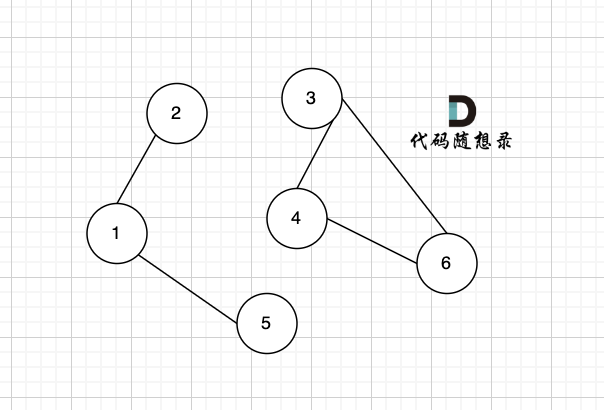

#### 图论理论基础

**度**：无向图中有几条边连接该节点，该节点就有几度。

在有向图中，每个节点有出度和入度。

**入度**：指向该节点边的个数。

出度：从该节点出发的边的个数。

**连通图：**在无向图中，任何两个节点都是可以到达的，我们称之为连通图

反之，为非连通图

**强连通图：** 在有向图中，任何两个节点是可以**相互到达**的

**连通分量：** 在无向图中的极大连通子图称之为该图的一个连通分量



该无向图中 节点1、节点2、节点5 构成的子图就是 该无向图中的一个连通分量，该子图所有节点都是相互可达到的。

同理，节点3、节点4、节点6 构成的子图 也是该无向图中的一个连通分量。


**图的构造**

一般使用邻接表、邻接矩阵 或者用类来表示。

主要是 朴素存储、邻接表和邻接矩阵。


**图的遍历**

图的遍历方式基本是两大类：

- 深度优先搜索（dfs）
- 广度优先搜索（bfs）


- dfs是可一个方向去搜，不到黄河不回头，直到遇到绝境了，搜不下去了，再换方向（换方向的过程就涉及到了回溯）。
- bfs是先把本节点所连接的所有节点遍历一遍，走到下一个节点的时候，再把连接节点的所有节点遍历一遍，搜索方向更像是广度，四面八方的搜索过程。


#### 797\. 所有可能的路径
-------------

给你一个有 `n` 个节点的 **有向无环图（DAG）**，请你找出所有从节点 `0` 到节点 `n-1` 的路径并输出（**不要求按特定顺序**）

 `graph[i]` 是一个从节点 `i` 可以访问的所有节点的列表（即从节点 `i` 到节点 `graph[i][j]`存在一条有向边）。

**示例 1：**


**输入：**graph = \[\[1,2\],\[3\],\[3\],\[\]\]
**输出：**\[\[0,1,3\],\[0,2,3\]\]
**解释：**有两条路径 0 -> 1 -> 3 和 0 -> 2 -> 3


```java
class Solution {
    List<List<Integer>> ans = new ArrayList<>();
    List<Integer> path = new ArrayList<>();
    //dfs搜索就完事了
    int[][] g;
    int n;
    public List<List<Integer>> allPathsSourceTarget(int[][] graph) {
        // 0 ~ n-1
        g = graph;
        n = g.length;
        path.add(0);
        dfs(0);
        return ans;
    }
    public void dfs(int x){
        //终止条件
        if(x == n-1){
            ans.add(new ArrayList<>(path));
            return;
        }
        for(int a : g[x]){
            path.add(a);
            dfs(a);
            path.remove(path.size()-1);
        }
    }
}
```


#### 200\. 岛屿数量
----------

给你一个由 `'1'`（陆地）和 `'0'`（水）组成的的二维网格，请你计算网格中岛屿的数量。

岛屿总是被水包围，并且每座岛屿只能由水平方向和/或竖直方向上相邻的陆地连接形成。

此外，你可以假设该网格的四条边均被水包围。

**示例 1：**

**输入：**grid = \[
  \["1","1","1","1","0"\],
  \["1","1","0","1","0"\],
  \["1","1","0","0","0"\],
  \["0","0","0","0","0"\]
\]
**输出：**1


```java
class Solution {

    public int numIslands(char[][] grid) {
        int ans = 0;
        // 1 陆地 0 水  岛屿被水包围
        //从(i, j)向此点的上下左右(i+1,j),(i-1,j),(i,j+1),(i,j-1)做深度搜索
        for(int i=0;i<grid.length;i++){
            for(int j = 0; j < grid[0].length; j++) {
                if(grid[i][j] == '1'){
                    //dfs(grid,i,j);
                    bfs(grid,i,j);
                    ans++;
                }
            }
        }
        return ans;
    }
    public void dfs(char[][] grid, int i, int j){
        if(i<0 || j<0 || i>=grid.length || j >=grid[0].length || grid[i][j] == '0') return;
        //标记这个点已经搜过了 以免之后重复搜索相同岛屿
        grid[i][j] = '0';
        dfs(grid,i+1,j);
        dfs(grid,i-1,j);
        dfs(grid,i,j+1);
        dfs(grid,i,j-1);

    }
	// bfs方法
    public void bfs(char[][] grid, int i, int j){
        Queue<int[]> list = new LinkedList<>();
        list.add(new int[]{i,j} );
        while(!list.isEmpty()){
            int[] cur = list.remove();
            i = cur[0];
            j = cur[1];
            if(0 <= i && i < grid.length && 0 <= j && j < grid[0].length && grid[i][j] == '1') {
                grid[i][j] = '0';
                list.add(new int[] { i + 1, j });
                list.add(new int[] { i - 1, j });
                list.add(new int[] { i, j + 1 });
                list.add(new int[] { i, j - 1 });
            }
        }
    }
}
```


#### 994\. 腐烂的橘子
-----------

在给定的 `m x n` 网格 `grid` 中，每个单元格可以有以下三个值之一：

*   值 `0` 代表空单元格；
*   值 `1` 代表新鲜橘子；
*   值 `2` 代表腐烂的橘子。

每分钟，腐烂的橘子 **周围 4 个方向上相邻** 的新鲜橘子都会腐烂。

返回 _直到单元格中没有新鲜橘子为止所必须经过的最小分钟数。如果不可能，返回 `-1`_ 。

**示例 1：**

****

**输入：**grid = \[\[2,1,1\],\[1,1,0\],\[0,1,1\]\]
**输出：**4


这道题的主要思路是：

- 一开始，我们找出所有腐烂的橘子，将它们放入队列，作为第 0 层的结点。
- 然后进行 BFS 遍历，每个结点的相邻结点可能是上、下、左、右四个方向的结点，注意判断结点位于网格边界的特殊情况。
- 由于可能存在无法被污染的橘子，我们需要记录新鲜橘子的数量。在 BFS 中，每遍历到一个橘子（污染了一个橘子），就将新鲜橘子的数量减一。如果 BFS 结束后这个数量仍未减为零，说明存在无法被污染的橘子。

```java
class Solution {
    public int orangesRotting(int[][] grid) {
    int M = grid.length;
    int N = grid[0].length;
    Queue<int[]> queue = new LinkedList<>();

    int count = 0; // count 表示新鲜橘子的数量
    for (int r = 0; r < M; r++) {
        for (int c = 0; c < N; c++) {
            if (grid[r][c] == 1) {
                count++;
            } else if (grid[r][c] == 2) {
                queue.add(new int[]{r, c});
            }
        }
    }

    int round = 0; // round 表示腐烂的轮数，或者分钟数
    while (count > 0 && !queue.isEmpty()) {
        round++;
        int n = queue.size();
        for (int i = 0; i < n; i++) {
            int[] orange = queue.poll();
            int r = orange[0];
            int c = orange[1];
            if (r-1 >= 0 && grid[r-1][c] == 1) {
                grid[r-1][c] = 2;
                count--;
                queue.add(new int[]{r-1, c});
            }
            if (r+1 < M && grid[r+1][c] == 1) {
                grid[r+1][c] = 2;
                count--;
                queue.add(new int[]{r+1, c});
            }
            if (c-1 >= 0 && grid[r][c-1] == 1) {
                grid[r][c-1] = 2;
                count--;
                queue.add(new int[]{r, c-1});
            }
            if (c+1 < N && grid[r][c+1] == 1) {
                grid[r][c+1] = 2;
                count--;
                queue.add(new int[]{r, c+1});
            }
        }
    }

    if (count > 0) {
        return -1;
    } else {
        return round;
    }
}
}
```


