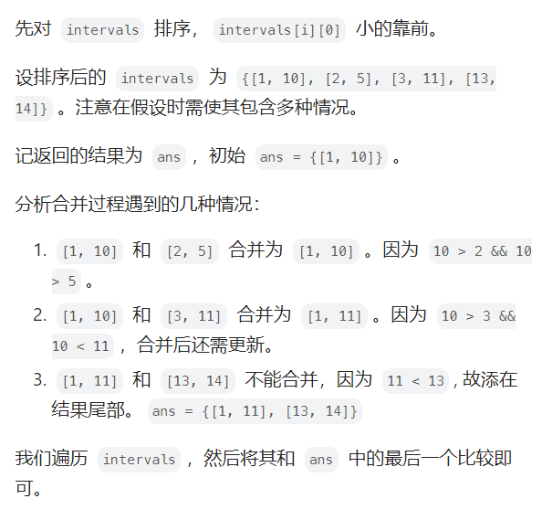

#### 1.移除元素
```java
class Solution {
    public int removeElement(int[] nums, int val) {
        // 双指针 原地移除 val元素

        //先来个暴力解法
        /*
        int n = nums.length;
        for(int i=0;i<n;i++){
            if(nums[i] == val){
                for(int j=i+1;j<n;j++){
                    nums[j-1] = nums[j];
                }
                i--;
                n--;
            }
        }
        return n;
        */
        // 双指针  快慢
        int n = nums.length, slow = 0 ,fast = 0;
        while(fast<n){
            if(nums[fast] != val){
                nums[slow] = nums[fast];
                slow++;
            }
            fast++;
        }
        return slow;
    }
}
```

#### 2.有序数组的平方
```java
class Solution {
    public int[] sortedSquares(int[] nums) {
        // 平方 非递减 可能有负数
        /*
        //1.直接暴力排序
        int n = nums.length;
        for(int i=0; i<n; i++){
            nums[i] *= nums[i];
        }
        Arrays.sort(nums);
        return nums;
        */

        // 2. 双指针 最大的值在两端
        int n = nums.length, left = 0, right = n-1;
        int[] result = new int[n];
        int index = n - 1;
        while(left<=right){
            int l = nums[left] * nums[left];
            int r = nums[right] * nums[right];
            if(l<r) {
                result[index] = r;
                index--;
                right--;
            }
            else {
                result[index] = l;
                index--;
                left++;
            }
        }
        return result;
    }
}
```

#### 3.长度最小的子数组
[链接](https://leetcode.cn/problems/minimum-size-subarray-sum/description/)
滑动窗口的思想，把双层遍历变为一层for循环，本质还是一个双指针
```java

class Solution {
    public int minSubArrayLen(int target, int[] nums) {
        // 要找的是连续数组 满足>=target
        //滑动窗口 就是要用一个for循环搞定 暴力是2个for循环
        int left = 0;
        int sum = 0;
        int result = Integer.MAX_VALUE;
        for(int right = 0; right<nums.length;right++){
            sum += nums[right];
            while(sum >= target){ // 如果满足了条件 那么就要去找一个最小的长度 所以是while
                result = Math.min(result,right-left+1);
                sum -= nums[left++]; // 不断变更起始位置
            }
        } 
    return result == Integer.MAX_VALUE ? 0 : result;
    }
}

// 暴力解法 超时
/*
class Solution{
public int minSubArrayLen(int s, int[] nums) {
        int min = Integer.MAX_VALUE;
        for (int i = 0; i < nums.length; i++) {
            int sum = nums[i];
            if (sum >= s)
                return 1;
            for (int j = i + 1; j < nums.length; j++) {
                sum += nums[j];
                if (sum >= s) {
                    min = Math.min(min, j - i + 1);
                    break;
                }
            }
        }
        return min == Integer.MAX_VALUE ? 0 : min;
    }
}
*/

    

```
#### 4.水果成篮
[链接](https://leetcode.cn/problems/fruit-into-baskets/solutions/3018030/hua-dong-chuang-kou-wen-ti-de-tong-jie-j-zwys/)
```java
class Solution {
    public int totalFruit(int[] fruits) {
        //找至多包含两种元素的最长子串，返回其长度

        // 存储的是水果种类，两个篮子，每个篮子只能装一种水果
        // 一棵树只能摘一个果子 找最大数目
        //滑动窗口 最大种类不超过两种： 考虑哈希表 2个键值对
        int left = 0;
        Map<Integer,Integer> cnt = new HashMap<>();
        int n = fruits.length; //树个数
        int result = 0;
        for(int right = 0; right<n; right++){
            cnt.put(fruits[right],cnt.getOrDefault(fruits[right], 0) + 1);
            while(cnt.size()>2){
                cnt.put(fruits[left],cnt.get(fruits[left]) -1); //重新赋值
                if (cnt.get(fruits[left]) == 0) {
                    cnt.remove(fruits[left]);
                }
                left++;
            }
            result = Math.max(result,right-left+1);
        }
    return result;
    }
}
```


#### 6.区间和


#### 560. 和为 K 的子数组
---------------
[https://leetcode.cn/problems/subarray-sum-equals-k/description/](https://leetcode.cn/problems/subarray-sum-equals-k/description/)
给你一个整数数组 `nums` 和一个整数 `k` ，请你统计并返回 _该数组中和为 `k` 的子数组的个数_ 。
子数组是数组中元素的连续非空序列。
**示例 2：**
**输入：**nums = \[1,2,3\], k = 3
**输出：**2
1. 枚举
```java
public int subarraySum(int[] nums, int k) {
        // 和为k的子数组  
        // 子数组：数组中元素的连续非空序列
        int count = 0;
        //如果我们知道 [j,i] 子数组的和，就能 O(1) 推出 [j−1,i] 的和
        int n = nums.length;
        for(int start=0;start<n;start++){
            int sum = 0;
            for(int end = start;end>=0;end--){
                sum += nums[end];
                if(sum == k) count++;
            }
        }
        return count;
    }
```
2. 前缀和 + 哈希表
![[pictures/Pasted image 20250210125014.png]]
```java
public class Solution {
    public int subarraySum(int[] nums, int k) {
        int count = 0, pre = 0;
        HashMap < Integer, Integer > mp = new HashMap < > ();
        mp.put(0, 1);
        for (int i = 0; i < nums.length; i++) {
            pre += nums[i];
            if (mp.containsKey(pre - k)) {
                count += mp.get(pre - k);
            }
            mp.put(pre, mp.getOrDefault(pre, 0) + 1);
        }
        return count;
    }
}
```

#### 167. 两数之和 II - 输入有序数组
----------------------

给你一个下标从 **1** 开始的整数数组 `numbers` ，该数组已按 **非递减顺序排列**  ，请你从数组中找出满足相加之和等于目标数 `target` 的两个数。如果设这两个数分别是 `numbers[index1]` 和 `numbers[index2]` ，则 `1 <= index1 < index2 <= numbers.length` 。
以长度为 2 的整数数组 `[index1, index2]` 的形式返回这两个整数的下标 `index1` 和 `index2`。
[https://leetcode.cn/problems/two-sum-ii-input-array-is-sorted/description/](https://leetcode.cn/problems/two-sum-ii-input-array-is-sorted/description/)
这题主要是要输出index
```java
class Solution {
    public int[] twoSum(int[] numbers, int target) {
        //要想不暴力求解要用好有序这个性质
        // 从前 后同时开始搜索，逼近target
        int n = numbers.length;
        int left = 0, right = n-1;
        int[] result = new int[2];
        while(left<right){
            int leftnum = numbers[left];
            int rightnum = numbers[right];
            if(leftnum + rightnum == target) {
                result[0] = left+1;
                result[1] = right+1;
                return result;
            }
            else if(leftnum + rightnum > target){
                // 大了，要缩小
                right--;
            } 
            else left++;
        }
        return result;
    }
}
```

#### 15.三数之和
要注意的点在于：如何处理重复数字
```java
class Solution {
    public List<List<Integer>> threeSum(int[] nums) {
        // 要注意的是不能有重复的元素 i j k
        // 本质其实还是双指针
        Arrays.sort(nums);
        List<List<Integer>> ans = new ArrayList<>();
        int n = nums.length;
        for(int i=0;i<n-2;i++){
            int x = nums[i];
            if (i > 0 && x == nums[i - 1]) continue; // 跳过重复数字
            int j = i+1, k = n-1;
            
            while(j<k){
                int sum = x + nums[j] + nums[k];
                if(sum>0) k--;
                else if(sum<0) j++;
                else {
                    ans.add(List.of(x,nums[j],nums[k]));
                    for (j++; j < k && nums[j] == nums[j - 1]; j++); // 跳过重复数字
                    for (k--; k > j && nums[k] == nums[k + 1]; k--); // 跳过重复数字
                }
            }
        }
        return ans;
    }
}
```


#### 53\. 最大子数组和
-----------

给你一个整数数组 `nums` ，请你找出一个具有最大和的连续子数组（子数组最少包含一个元素），返回其最大和。

**子数组**

是数组中的一个连续部分。

**示例 1：**

**输入：**nums = \[-2,1,-3,4,-1,2,1,-5,4\]
**输出：**6
**解释：**连续子数组 \[4,-1,2,1\] 的和最大，为 6 。


#### 56\. 合并区间
---------

以数组 `intervals` 表示若干个区间的集合，其中单个区间为 `intervals[i] = [starti, endi]` 。请你合并所有重叠的区间，并返回 _一个不重叠的区间数组，该数组需恰好覆盖输入中的所有区间_ 。

**示例 1：**

**输入：**intervals = \[\[1,3\],\[2,6\],\[8,10\],\[15,18\]\]
**输出：**\[\[1,6\],\[8,10\],\[15,18\]\]
**解释：**区间 \[1,3\] 和 \[2,6\] 重叠, 将它们合并为 \[1,6\].




```java
class Solution {
    public int[][] merge(int[][] intervals) {
        // 合并区间 intervals[i] = [starti, endi] 
        // [1,3],[2,6],[8,10],[15,18]
        // 先进行排序，左端点对齐 
        Arrays.sort(intervals, (p,q) -> p[0] - q[0]);
        List<int[]> ans = new ArrayList<>();
        for (int i = 0; i < intervals.length; i++) {
            if(ans.isEmpty())  ans.add(intervals[i]);
            else{
                int right = ans.get(ans.size()-1)[1]; // 右端点
                int from = intervals[i][0], to = intervals[i][1];
                //相交 右端点比左端点大就相交了
                if(right>=from){
                    ans.get(ans.size()-1)[1] = Math.max(right,to);
                }
                //不相交 直接添加就行了
                else {
                    ans.add(intervals[i]);
                }
            }
        }
        return ans.toArray(new int[ans.size()][]);
    }
}
```


#### 189\. 轮转数组
----------

给定一个整数数组 `nums`，将数组中的元素向右轮转 `k` 个位置，其中 `k` 是非负数。

**示例 1:**

**输入:** nums = \[1,2,3,4,5,6,7\], k = 3
**输出:** `[5,6,7,1,2,3,4]`
**解释:**
向右轮转 1 步: `[7,1,2,3,4,5,6]`
向右轮转 2 步: `[6,7,1,2,3,4,5]`
向右轮转 3 步: `[5,6,7,1,2,3,4]`


```java
class Solution {
    public void rotate(int[] nums, int k) {
        // 三次旋转
        /*
        n 7 k 3
        原始数组            : 1 2 3 4 5 6 7
        反转所有数字后       : 7 6 5 4 3 2 1
        反转前 k 个数字后    : 5 6 7 4 3 2 1
        反转后 n-k 个数字后  : 5 6 7 1 2 3 4
        */
        int n = nums.length;
        k %= nums.length;
        reverse(nums,0,n-1);
        reverse(nums,0,k-1);
        reverse(nums,k,n-1);

    }
    public void reverse(int[] nums, int start, int end){
        while(start<end){
            int temp = nums[start];
            nums[start] = nums[end];
            nums[end] = temp;
            start++;
            end -= 1;
        }
     }

    
}
```


#### 238\. 除自身以外数组的乘积
----------------

给你一个整数数组 `nums`，返回 数组 `answer` ，其中 `answer[i]` 等于 `nums` 中除 `nums[i]` 之外其余各元素的乘积 。

题目数据 **保证** 数组 `nums`之中任意元素的全部前缀元素和后缀的乘积都在  **32 位** 整数范围内。

请 **不要使用除法，**且在 `O(n)` 时间复杂度内完成此题。

**示例 1:**

**输入:** nums = `[1,2,3,4]`
**输出:** `[24,12,8,6]`

```java
class Solution {
    public int[] productExceptSelf(int[] nums) {
        // 前缀和
        //定义 pre[i] 表示从 nums[0] 到 nums[i−1] 的乘积。
        //定义 suf[i] 表示从 nums[i+1] 到 nums[n−1] 的乘积。
        int n = nums.length;
        int[] pre = new int[n];
        int[] suf = new int[n];
        pre[0] = 1;
        suf[n-1] = 1;
        for(int i=1;i<n;i++){
            pre[i] = pre[i-1] * nums[i-1];
        }
        for(int i=n-2;i>=0;i--){
            suf[i] = suf[i+1] * nums[i+1];
        }
        int[] ans = new int[n];
        for(int i=0;i<n;i++){
            ans[i] = pre[i] * suf[i];
        }
        return ans;
    }
}
```


## 矩阵


#### 5.螺旋矩阵
总的来说就是模拟过程
模拟顺时针画矩阵的过程:
填充上行从左到右
填充右列从上到下
填充下行从右到左
填充左列从下到上
**边界条件非常多**

![[pictures/Pasted image 20250124011509.png]]
```java
class Solution {
    public int[][] generateMatrix(int n) {
        int l = 0, r = n-1, t = 0, b = n-1;
        int[][] result = new int[n][n];
        int num = 1, tar = n*n;
        while(num<=tar){
            //上
            for(int i=l;i<=r;i++) result[t][i] = num++;
            t++;
            //右
            for(int i=t;i<=b;i++) result[i][r] = num++;
            r--;
            //下
            for(int i=r;i>=l;i--) result[b][i] = num++;
            b--;
            //左
            for(int i=b;i>=t;i--) result[i][l] = num++;
            l++;
        }
        return result;
    }
}
```

变式：顺时针输出矩阵元素：m * n

```java

class Solution {
    public List<Integer> spiralOrder(int[][] matrix) {
        // m * n 行数 matrix.length 列数 matrix[0].length
        int l = 0, r = matrix[0].length - 1, t = 0, b = matrix.length - 1;
        List<Integer> list = new ArrayList<>();
        int temp  = (r+1) * (b+1);
        while (list.size() < temp) {
            // 上
            for (int i = l; i <= r; i++) {
                list.add(matrix[t][i]);
                if(list.size() ==  temp  ) return list;
            }
            t++;
            // 右
            for (int i = t; i <= b; i++) {
                list.add(matrix[i][r]);
                if(list.size() == temp ) return list;
            }
            r--;
            // 下
                for (int i = r; i >= l; i--) {
                    list.add(matrix[b][i]);
                    if(list.size() == temp ) return list;
                }
                b--;
            
            // 左
                for (int i = b; i >= t; i--) {
                    list.add(matrix[i][l]);
                    if(list.size() == temp ) return list;
                }
                l++;
        }
        return list;
    }
}

```


#### 240\. 搜索二维矩阵 II
---------------

编写一个高效的算法来搜索 `_m_ x _n_` 矩阵 `matrix` 中的一个目标值 `target` 。该矩阵具有以下特性：

*   每行的元素从左到右升序排列。
*   每列的元素从上到下升序排列。

**示例 1：**


**输入：**matrix = \[\[1,4,7,11,15\],\[2,5,8,12,19\],\[3,6,9,16,22\],\[10,13,14,17,24\],\[18,21,23,26,30\]\], target = 5
**输出：**true

