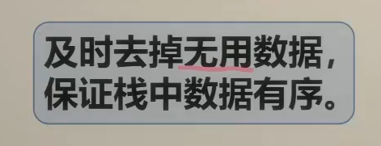

**栈**

```java
Stack<Integer> stack = new Stack<>();
```

| `push()` | 元素入栈（添加至栈顶） |
| -------- | ---------------------- |
| `pop()`  | 栈顶元素出栈           |
| `peek()` | 访问栈顶元素           |

**队列**

Queue<Integer> queue = new LinkedList<>();

**双向队列**

```java
/* 初始化双向队列 */
Deque<Integer> deque = new LinkedList<>();

/* 元素入队 */
deque.offerLast(2);   // 添加至队尾
deque.offerLast(5);
deque.offerLast(4);
deque.offerFirst(3);  // 添加至队首
deque.offerFirst(1);
/* 访问元素 */
int peekFirst = deque.peekFirst();  // 队首元素
int peekLast = deque.peekLast();    // 队尾元素
/* 元素出队 */
int popFirst = deque.pollFirst();  // 队首元素出队
int popLast = deque.pollLast();    // 队尾元素出队
/* 获取双向队列的长度 */
int size = deque.size();
/* 判断双向队列是否为空 */
boolean isEmpty = deque.isEmpty();
```


#### 20\. 有效的括号

----------

给定一个只包括 `'('`，`')'`，`'{'`，`'}'`，`'['`，`']'` 的字符串 `s` ，判断字符串是否有效。

有效字符串需满足：

1.  左括号必须用相同类型的右括号闭合。
2.  左括号必须以正确的顺序闭合。
3.  每个右括号都有一个对应的相同类型的左括号。


**用栈解决的经典问题！**


什么情况下是有效字符串？

可以从消消乐的角度理解，每次可以消除一对**相邻**的匹配括号，不断消除，如果可以把 s 变成空字符串，则 s 是有效字符串。

比如 (), (()), \[()\], \[()\]{} 等等，都可以通过消除，把 s 变成空字符串。例如

\[()\]→\[\]→空串

**什么情况下是无效字符串？**

1.  左括号没有对应的右括号。例如 (()，缺失了一个右括号。
2.  右括号没有对应的左括号。例如 ())，缺失了一个左括号。
3.  括号类型不匹配。例如 \[()}，其中 \[ 要和 } 组成一对括号，但是括号类型不同。


以 s\={\[()\]} 为例说明：

1.  创建一个空栈。
2.  从左到右遍历 s。
3.  s\[0\]\={，这是一个左括号，入栈。
4.  s\[1\]\=\[，这是一个左括号，入栈。
5.  s\[2\]\=(，这是一个左括号，入栈。
6.  s\[3\]\=)，这是一个右括号，它必须和栈顶的 ( 组成一对（消除），弹出栈顶。
7.  s\[4\]\=\]，这是一个右括号，它必须和栈顶的 \[ 组成一对（消除），弹出栈顶。
8.  s\[5\]\=}，这是一个右括号，它必须和栈顶的 { 组成一对（消除），弹出栈顶。
9.  遍历结束，**由于栈为空，说明所有括号均已匹配完毕，返回 true**。反之，**如果在遍历的过程中，发现栈为空，或者括号类型不匹配的情况，返回 false。此外，如果遍历结束栈不为空，说明还有没匹配的左括号，返回 false。**


1.  由于括号两两一对，所以 s 的长度必须是偶数。如果 s 的长度是奇数，可以直接返回 false。
2.  我们可以创建一个哈希表（或者数组），保存每个右括号对应的左括号，这样可以直接判断栈顶的左括号是否与右括号为同一类型，从而省去大量 if-else 判断。

```java
class Solution {
    public boolean isValid(String s) {
        // s 仅由括号 '()[]{}' 组成
        // 消消乐 每次可以清除一对相邻的匹配括号，不断消除
        if(s.length() %2 !=0) return false; // 字符串的长度一定要是偶数才对
        // 括号的顺序不要错了
        Map<Character, Character> mp = new HashMap<>() {{
            put(')', '(');
            put(']', '[');
            put('}', '{');
        }};
        Deque<Character> st = new ArrayDeque<>();
        for(char c : s.toCharArray()){
            // 左括号入栈
            if(!mp.containsKey(c)){
                st.push(c);
                // 判断右括号 1.根本没有左括号push 2.右括号对不上左括号
            } else if(st.isEmpty() || st.pop() != mp.get(c)){
                return false; // 没有左括号 或者 左括号类型不对
            }
        }
        return st.isEmpty();
    }
}
```


#### 232\. 用栈实现队列
------------

请你仅使用两个栈实现先入先出队列。队列应当支持一般队列支持的所有操作（`push`、`pop`、`peek`、`empty`）：

实现 `MyQueue` 类：

*   `void push(int x)` 将元素 x 推到队列的末尾
*   `int pop()` 从队列的开头移除并返回元素
*   `int peek()` 返回队列开头的元素
*   `boolean empty()` 如果队列为空，返回 `true` ；否则，返回 `false`

**说明：**

*   你 **只能** 使用标准的栈操作 —— 也就是只有 `push to top`, `peek/pop from top`, `size`, 和 `is empty` 操作是合法的。
*   你所使用的语言也许不支持栈。你可以使用 list 或者 deque（双端队列）来模拟一个栈，只要是标准的栈操作即可。


**思路**

使用栈来模拟队列的行为，如果仅仅用一个栈，是一定不行的，所以需要两个栈**一个输入栈，一个输出栈**，这里要注意输入栈和输出栈的关系。

在push数据的时候，只要数据放进输入栈就好，**但在pop的时候，操作就复杂一些，输出栈如果为空，就把进栈数据全部导入进来（注意是全部导入）**，再从出栈弹出数据，如果输出栈不为空，则直接从出栈弹出数据就可以了。

```java
class MyQueue {
    Stack<Integer> stackin;
    Stack<Integer> stackout;
    public MyQueue() {
        stackin = new Stack<>();
        stackout = new Stack<>();
    }
    public void push(int x) {
        // 入队
        stackin.push(x);

    }
    public int pop() {
        // 出队
        //输出栈空的时候先导入数据
        if(stackout.isEmpty()){
            while(!stackin.isEmpty()){
                stackout.push(stackin.pop());
            }
        }
        return stackout.pop();
    }
    public int peek() {
        if(stackout.isEmpty()){
            while(!stackin.isEmpty()){
                stackout.push(stackin.pop());
            }
        }
        return stackout.peek();
    }
    public boolean empty() {
        return stackin.isEmpty() && stackout.isEmpty();
    }
}
```


#### 225\. 用队列实现栈
------------

请你仅使用两个队列实现一个后入先出（LIFO）的栈，并支持普通栈的全部四种操作（`push`、`top`、`pop` 和 `empty`）。

实现 `MyStack` 类：

*   `void push(int x)` 将元素 x 压入栈顶。
*   `int pop()` 移除并返回栈顶元素。
*   `int top()` 返回栈顶元素。
*   `boolean empty()` 如果栈是空的，返回 `true` ；否则，返回 `false` 。


**思路**

**用两个队列que1和que2实现队列的功能，que2其实完全就是一个备份的作用**，把que1最后面的元素以外的元素都备份到que2，然后弹出最后面的元素，再把其他元素从que2导回que1。

```java
class MyStack {
    //两个队列 其实一个就够了  栈 后入先出
    Queue<Integer> queue1;
    Queue<Integer> queue2;
    public MyStack() {
        queue1 = new LinkedList<>();
        queue2 = new LinkedList<>();
    }
    public void push(int x) {
        queue2.offer(x); // 先放在辅助队列中
        while (!queue1.isEmpty()){
            queue2.offer(queue1.poll());
        }
        Queue<Integer> queueTemp;
        queueTemp = queue1;
        queue1 = queue2;
        queue2 = queueTemp; // 最后交换queue1和queue2，将元素都放到queue1中
    }
    public int pop() {
        return queue1.poll();
    }
    
    public int top() {
        return queue1.peek();
    }
    
    public boolean empty() {
        return queue1.isEmpty();
    }
}
```


#### 1047\. 删除字符串中的所有相邻重复项
---------------------

给出由小写字母组成的字符串 `s`，**重复项删除操作**会选择两个相邻且相同的字母，并删除它们。

在 `s` 上反复执行重复项删除操作，直到无法继续删除。

在完成所有重复项删除操作后返回最终的字符串。答案保证唯一。


```java
class Solution {
    public String removeDuplicates(String s) {
        //重复删除两个相邻相同的字母
        //栈很适合做这种匹配工作
        if(s.length() == 1) return s;
        StringBuilder sb = new StringBuilder();
        Stack<Character> stack = new Stack<>();
        char[] ss = s.toCharArray();
        stack.push(ss[0]);
        for(int i=1;i<ss.length;i++){
            if(!stack.isEmpty() && ss[i] == stack.peek()){
                stack.pop();
            } else{
                stack.push(ss[i]);
            }
        }
        for (char c : stack) {
            sb.append(c);
        }
        return sb.toString();
    }
}
```


#### 150\. 逆波兰表达式求值
--------------

给你一个字符串数组 `tokens` ，表示一个根据 [逆波兰表示法](https://baike.baidu.com/item/%E9%80%86%E6%B3%A2%E5%85%B0%E5%BC%8F/128437) 表示的算术表达式。

请你计算该表达式。返回一个表示表达式值的整数。

```java
class Solution {
    public int evalRPN(String[] tokens) {
        Deque<Integer> stack = new LinkedList<Integer>();
        int n = tokens.length;
        for(int i=0;i<n;i++){
            String token = tokens[i];
            if(isNumber(token)){
                stack.push(Integer.parseInt(token));
            }else{
                int num2 = stack.pop();
                int num1 = stack.pop();
                switch(token){
                    case "+":
                        stack.push(num1 + num2);
                        break;
                    case "-":
                        stack.push(num1 - num2);
                        break;
                    case "*":
                        stack.push(num1 * num2);
                        break;
                    case "/":
                        stack.push(num1 / num2);
                        break;
                    default:
                }
            }
        }
        return stack.pop();
    }
    public boolean isNumber(String token) {
        return !("+".equals(token) || "-".equals(token) || "*".equals(token) || "/".equals(token));
    }

}
```


#### 155\. 最小栈
---------

设计一个支持 `push` ，`pop` ，`top` 操作，并能在常数时间内检索到最小元素的栈。

实现 `MinStack` 类:

*   `MinStack()` 初始化堆栈对象。
*   `void push(int val)` 将元素val推入堆栈。
*   `void pop()` 删除堆栈顶部的元素。
*   `int top()` 获取堆栈顶部的元素。
*   `int getMin()` 获取堆栈中的最小元素。

```java
class MinStack {
    //常数时间内检索到最小元素的栈
    private Stack<Integer> stack;
    private Stack<Integer> min_stack; // 辅助栈，存放stack最小值
    public MinStack() {
        stack = new Stack<>();
        min_stack = new Stack<>();
    }
    public void push(int val) {
        stack.push(val);
        if(min_stack.isEmpty() || val <= min_stack.peek()){
            min_stack.push(val);
        }
    }
    // 出栈 
    //除了要从主栈 stack 中移除栈顶元素，还需要检查该元素是否也是辅助栈 min_stack 的栈顶元素
    //（即当前的最小元素），如果是，则也需要从辅助栈中移除
    public void pop() {
        if(!stack.isEmpty()){
            if(stack.pop().equals(min_stack.peek())) {
            min_stack.pop();
        }
        }
    }
    // 栈顶
    public int top() {
        return stack.peek();
    }
    // 获取最小元素
    public int getMin() {
        return min_stack.peek();
    }
}

```


#### 394\. 字符串解码（递归算法 待定）
-----------

给定一个经过编码的字符串，返回它解码后的字符串。

编码规则为: `k[encoded_string]`，表示其中方括号内部的 `encoded_string` 正好重复 `k` 次。注意 `k` 保证为正整数。

你可以认为输入字符串总是有效的；输入字符串中没有额外的空格，且输入的方括号总是符合格式要求的。

此外，你可以认为原始数据不包含数字，所有的数字只表示重复的次数 `k` ，例如不会出现像 `3a` 或 `2[4]` 的输入。

**示例 1：**

**输入：**s = "3\[a\]2\[bc\]"
**输出：**"aaabcbc"

```java
class Solution {
    public String decodeString(String s) {
        // 返回解码
        //k[encoded_string]，表示其中方括号内部的 encoded_string 正好重复 k 次
        //s = "3[a2[c]]"
        //需要从内向外生成与拼接字符串，这与栈的先入后出特性对应
        StringBuilder ans = new StringBuilder();
        // kstack 重复次数 restack 用于存储每个 [ 之前已经构建好的字符串
        Stack<Integer> kstack = new Stack<>();
        Stack<StringBuilder> restack = new Stack<>();
        int k = 0;
        for(char c : s.toCharArray()){
            if(c == '['){
                // 入栈
                kstack.push(k);
                restack.push(ans);
                //重置
                k = 0;
                ans = new StringBuilder();
            } else if(c == ']'){
                //出栈
                int curk = kstack.pop();
                StringBuilder temp = new StringBuilder();
                for(int i = 0; i < curk; i++){
                    temp.append(ans);
                }
                ans = restack.pop().append(temp);
            } else if(c >= '0' && c <= '9'){
                k = c - '0' + k*10; 
            } else{
                ans.append(c);
            }
        }

        return ans.toString();
    }
}
```


#### 739\. 每日温度（单调栈）
----------

给定一个整数数组 `temperatures` ，表示每天的温度，返回一个数组 `answer` ，其中 `answer[i]` 是指对于第 `i` 天，下一个更高温度出现在几天后。如果气温在这之后都不会升高，请在该位置用 `0` 来代替。

**示例 1:**

**输入:** `temperatures` = \[73,74,75,71,69,72,76,73\]
**输出:** \[1,1,4,2,1,1,0,0\]


**思路**

单调栈是一种特殊的栈结构，它的特点在于栈内元素是单调递增或者单调递减的。借助这一特性，单调栈能够高效地解决某些特定类型的算法问题，例如找出数组中每个元素的下一个更大元素、计算直方图中最大矩形面积等

### 单调栈的分类


- **单调递增栈**：栈内元素从栈底到栈顶是单调递增的，也就是新元素入栈时，若栈顶元素大于新元素，则将栈顶元素出栈，直至满足单调递增的条件后，再将新元素入栈。
- **单调递减栈**：栈内元素从栈底到栈顶是单调递减的，即新元素入栈时，若栈顶元素小于新元素，则将栈顶元素出栈，直到符合单调递减的条件后，才把新元素入栈。



```java
 public int[] dailyTemperatures(int[] temperatures) {
        // 1.从左到右 栈中记录还没算出下一个更大元素的那些数的下标。
        int n = temperatures.length;
        int[] ans = new int[n];
        Deque<Integer> st = new ArrayDeque<>(); // todolist
        for(int i=0;i<n;i++){
            int temp = temperatures[i];
            while(!st.isEmpty() && temp > temperatures[st.peek()]){
                int j = st.pop();
                ans[j] = i-j;
            }
            st.push(i);
        }
        return ans;
    }
```


#### 347\. 前 K 个高频元素（Hard）
---------------

给你一个整数数组 `nums` 和一个整数 `k` ，请你返回其中出现频率前 `k` 高的元素。你可以按 **任意顺序** 返回答案。

