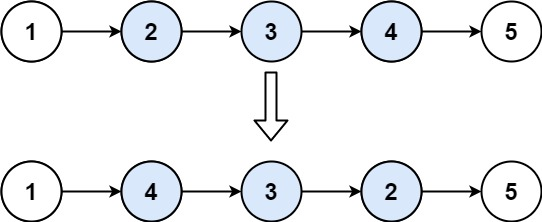

#### 1.移除链表元素

设置一个空节点连接头结点就好了 省去了分情况讨论头结点删去的问题
```java
public ListNode removeElements(ListNode head, int val) {
        // 设置虚拟头结点
        ListNode temp = new ListNode();
        temp.next = head;
        ListNode curr = temp;
        while(curr.next != null){
            if(curr.next.val == val){
                curr.next = curr.next.next;
            } else{
                curr = curr.next;
            }
        }
        return temp.next;
    }
```
递归方法
```java
 // 递归方法
    if(head == null) return head;
    head.next = removeElements(head.next, val);
        if (head.val == val) {
            return head.next;
        }
        return head;
    }
```

#### 2.反转链表
```java
// 迭代 1 2 3 null   3 2 1 null
        //双指针
        ListNode prev = null;
        ListNode curr = head;
        ListNode temp = null;
        while(curr != null){
            temp = curr.next;
            curr.next = prev;
            prev = curr;
            curr = temp;
        }
        return prev;
        
```
还有一种思路就是头插法
```java
	 //头插法
        ListNode dummy = new ListNode(-1);
        ListNode curr = head;
        dummy.next = null;
        while(curr != null){
            ListNode temp  =curr.next;
            curr.next = dummy.next;
            dummy.next = curr;
            curr  = temp;
        }
        return dummy.next;
```


#### 92\. 反转链表 II
------------

给你单链表的头指针 `head` 和两个整数 `left` 和 `right` ，其中 `left <= right` 。请你反转从位置 `left` 到位置 `right` 的链表节点，返回 **反转后的链表** 。

**示例 1：**



**输入：**head = \[1,2,3,4,5\], left = 2, right = 4
**输出：**\[1,4,3,2,5\]


其实就是反转链表 1 的 plus，注意要反转的区间即可

```java
public ListNode reverseBetween(ListNode head, int left, int right) {
        ListNode dummy = new ListNode(0, head);
        ListNode p0 = dummy;
        for(int i=0;i<left-1;i++){
            p0 = p0.next;
        }

        ListNode pre = null;
        ListNode cur = p0.next;
        for(int i=0;i<right - left + 1;i++){
            ListNode nxt = cur.next;
            cur.next = pre;
            pre = cur;
            cur = nxt;
        }
        p0.next.next = cur;
        p0.next = pre;
        return dummy.next;
    }
```


#### 25\. K 个一组翻转链表(HARD)

--------------

给你链表的头节点 `head` ，每 `k` 个节点一组进行翻转，请你返回修改后的链表。

`k` 是一个正整数，它的值小于或等于链表的长度。如果节点总数不是 `k` 的整数倍，那么请将最后剩余的节点保持原有顺序。

你不能只是单纯的改变节点内部的值，而是需要实际进行节点交换。

**示例 1：**


**输入：**head = \[1,2,3,4,5\], k = 2
**输出：**\[2,1,4,3,5\]


其实还是延续上一题的思路

```java
public ListNode reverseKGroup(ListNode head, int k) {
        //给你链表的头节点 head ，每 k 个节点一组进行翻转
        // 统计节点个数
        int n = 0;
        for (ListNode cur = head; cur != null; cur = cur.next) {
            n++;
        }
        ListNode dummy = new ListNode(0, head);
        ListNode p0 = dummy;
        ListNode pre = null;
        ListNode cur = head;
        // k 个一组处理
        for (; n >= k; n -= k) {
            for (int i = 0; i < k; i++) { // 同 92 题
                ListNode nxt = cur.next;
                cur.next = pre; // 每次循环只修改一个 next，方便大家理解
                pre = cur;
                cur = nxt;
            }

            // 见视频
            ListNode nxt = p0.next;
            p0.next.next = cur;
            p0.next = pre;
            p0 = nxt;
        }
        return dummy.next;
    }
```


#### 3.设计链表


#### 4.两两交换链表中的节点
```java
class Solution {
    public ListNode swapPairs(ListNode head) {
        //虚拟头结点
        ListNode dumy = new ListNode(-1);
        dumy.next = head;
        ListNode cur = dumy;
        ListNode temp; 
        ListNode firstnode; 
        ListNode secondnode; 
        while(cur.next != null && cur.next.next != null){
            temp = cur.next.next.next;
            firstnode = cur.next;
            secondnode = cur.next.next;
            cur.next = secondnode;
            secondnode.next = firstnode;
            firstnode.next = temp;
            cur = firstnode;
        }
        return dumy.next;
    }
}
```

#### 5. 删除链表的倒数第N个节点
利用双指针和虚拟头结点：fast会比slow多n个距离，当fast到结尾null的时候就说明slow到了指定地点
```java
class Solution {
    public ListNode removeNthFromEnd(ListNode head, int n) {
        //新建一个虚拟头节点指向head
        ListNode dummyNode = new ListNode(0);
        dummyNode.next = head;
        //快慢指针指向虚拟头节点
        ListNode fastIndex = dummyNode;
        ListNode slowIndex = dummyNode;

        for(int i=0; i<=n;i++){
            fastIndex = fastIndex.next;
            }
        while(fastIndex!=null){
            slowIndex = slowIndex.next;
            fastIndex = fastIndex.next;
        }
        // 删除节点
        if(slowIndex.next !=null){
            slowIndex.next = slowIndex.next.next;
        }
        return dummyNode.next;
    }
}
```

#### 6.链表相交
```java

// 1.哈希表：先存A 然后搜B有没有A重复的就行了
public ListNode getIntersectionNode(ListNode headA, ListNode headB) {
        // 1.哈希表找重叠位置
        Set<ListNode> visited = new HashSet<ListNode>();
        ListNode temp = headA;
        while(temp!=null){
            visited.add(temp);
            temp = temp.next;
        }
        temp = headB;
        while(temp!=null){
            if(visited.contains(temp)) return temp;  //这就是起始节点
            temp = temp.next;
        }
        return null;
    }
```

```java
// 2. 双指针搜索:总体思路就是A遍历完A去B， B遍历完去A 最终就相遇了
        ListNode A = headA, B = headB;
        while(A!=B){
            A = A!=null ?A.next : headB;
            B = B!=null ?B.next : headA;
        }
        return B;
    }
```

#### 7.环形链表
这一题要找出来环的入口
```java

// 1. 还是延续了上一题的哈希表思路 更简单了 第一个重复的不就是环的入口
public ListNode detectCycle(ListNode head) {
        ListNode pos = head;
        Set<ListNode> visited = new HashSet<ListNode>();
        while(pos != null){
            if(visited.contains(pos)) return pos;
            else{
                visited.add(pos);
                pos = pos.next;
            }
        }
    return null;
    }
```

```java
// 2. 快慢指针： fast 2 slow 1 总会相遇
// 在判断有环的基础上找入口：在设立一个节点 从头开始和相遇节点走，二者相遇就是入口了
public ListNode detectCycle(ListNode head) {
        ListNode slow = head, fast = head;
        // 这里判断条件容易错：fast快 只需要判断fast即可
        while(fast!=null && fast.next!=null){
            slow = slow.next;
            fast = fast.next.next;
            if(slow == fast){ // round
                ListNode index1 = fast;
                ListNode index2 = head;
                while(index1 != index2){
                    index1 = index1.next;
                    index2 = index2.next;
                }
                return index1;
            }
        }
        return null;
    }
```


#### 142\. 环形链表 II
-------------

给定一个链表的头节点  `head` ，返回链表开始入环的第一个节点。 _如果链表无环，则返回 `null`。_

如果链表中有某个节点，可以通过连续跟踪 `next` 指针再次到达，则链表中存在环。 为了表示给定链表中的环，评测系统内部使用整数 `pos` 来表示链表尾连接到链表中的位置（**索引从 0 开始**）。如果 `pos` 是 `-1`，则在该链表中没有环。**注意：`pos` 不作为参数进行传递**，仅仅是为了标识链表的实际情况。

**不允许修改** 链表。

**示例 1：**


**输入：**head = \[3,2,0,-4\], pos = 1
**输出：**返回索引为 1 的链表节点
**解释：**链表中有一个环，其尾部连接到第二个节点。


```java
 public ListNode detectCycle(ListNode head) {
        ListNode slow = head, fast = head;
        // 这里判断条件容易错：fast快 只需要判断fast即可
        while(fast!=null && fast.next!=null){
            slow = slow.next;
            fast = fast.next.next;
            if(slow == fast){ // round
                ListNode index1 = fast;
                ListNode index2 = head;
                while(index1 != index2){
                    index1 = index1.next;
                    index2 = index2.next;
                }
                return index1;
            }
        }
        return null;
    }
```


#### 8.回文链表

先存储到数组里面 然后双指针 前后扫描就行了
```java
public boolean isPalindrome(ListNode head) {
        ListNode temp = head;
        List<Integer> vals = new ArrayList<>();
        while(temp!=null){
            vals.add(temp.val);
            temp = temp.next;
        }
        // 双指针
        int front = 0, back = vals.size()-1;
        while(front < back){
            if(!vals.get(front).equals(vals.get(back))) return false;
            front++;
            back--;
        }
        return true;
    }
```


#### 21\. 合并两个有序链表
-------------

将两个升序链表合并为一个新的 **升序** 链表并返回。新链表是通过拼接给定的两个链表的所有节点组成的。 

**示例 1：**


**输入：**l1 = \[1,2,4\], l2 = \[1,3,4\]
**输出：**\[1,1,2,3,4,4\]


```java
public ListNode mergeTwoLists(ListNode l1, ListNode l2) {
        if(l1 == null ) return l2;
        else if(l2 == null ) return l1;
        else if(l1.val < l2.val){
            l1.next = mergeTwoLists(l1.next,l2);
            return l1;
        } else{
            l2.next = mergeTwoLists(l1,l2.next);
            return l2;
        }
    }
```


#### 2\. 两数相加
--------

给你两个 **非空** 的链表，表示两个非负的整数。它们每位数字都是按照 **逆序** 的方式存储的，并且每个节点只能存储 **一位** 数字。

请你将两个数相加，并以相同形式返回一个表示和的链表。

你可以假设除了数字 0 之外，这两个数都不会以 0 开头。

**示例 1：**


**输入：**l1 = \[2,4,3\], l2 = \[5,6,4\]
**输出：**\[7,0,8\]
**解释：**342 + 465 = 807.


**思路：**构造一个新链表。每次都往里面添加加法后的新数字就可以了

```java
public ListNode addTwoNumbers(ListNode l1, ListNode l2) {
        // 虚空头结点
        ListNode pre = new ListNode(-1);
        ListNode cur = pre;
        int carry = 0;
        while(l1 != null || l2 != null){
            int x = l1 == null ? 0 : l1.val;
            int y = l2 == null ? 0 : l2.val;
            int sum = x + y + carry;
            carry = sum / 10;
            sum = sum % 10;
            cur.next = new ListNode(sum);

            cur = cur.next;
            if(l1 != null) l1 = l1.next;
            if(l2 != null) l2 = l2.next;

        }
        if(carry==1) cur.next = new ListNode(1);
        return pre.next;
    }
```


#### 138\. 随机链表的复制
-------------

给你一个长度为 `n` 的链表，每个节点包含一个额外增加的随机指针 `random` ，该指针可以指向链表中的任何节点或空节点。

构造这个链表的 **[深拷贝](https://baike.baidu.com/item/深拷贝/22785317?fr=aladdin)**。 深拷贝应该正好由 `n` 个 **全新** 节点组成，其中每个新节点的值都设为其对应的原节点的值。新节点的 `next` 指针和 `random` 指针也都应指向复制链表中的新节点，并使原链表和复制链表中的这些指针能够表示相同的链表状态。**复制链表中的指针都不应指向原链表中的节点** 。

例如，如果原链表中有 `X` 和 `Y` 两个节点，其中 `X.random --> Y` 。那么在复制链表中对应的两个节点 `x` 和 `y` ，同样有 `x.random --> y` 。

返回复制链表的头节点。

用一个由 `n` 个节点组成的链表来表示输入/输出中的链表。每个节点用一个 `[val, random_index]` 表示：

*   `val`：一个表示 `Node.val` 的整数。
*   `random_index`：随机指针指向的节点索引（范围从 `0` 到 `n-1`）；如果不指向任何节点，则为  `null` 。

你的代码 **只** 接受原链表的头节点 `head` 作为传入参数。

**示例 1：**


**输入：**head = \[\[7,null\],\[13,0\],\[11,4\],\[10,2\],\[1,0\]\]
**输出：**\[\[7,null\],\[13,0\],\[11,4\],\[10,2\],\[1,0\]\]


#### 148\. 排序链表
----------

给你链表的头结点 `head` ，请将其按 **升序** 排列并返回 **排序后的链表** 。

**示例 1：**


**输入：**head = \[4,2,1,3\]
**输出：**\[1,2,3,4\]


#### 146.LRU缓存（常考！）


